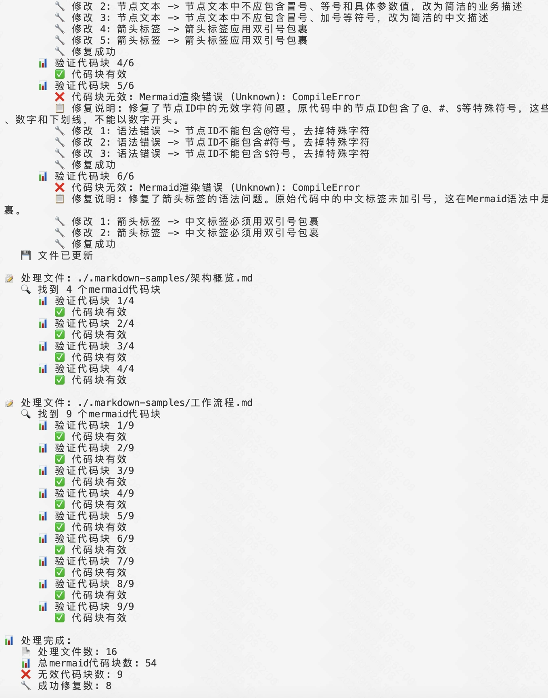

<p align="center">
  
</p>
<h3 align="center">Mermaid Fixer</h3>

<p align="center">
    <a href="./README.md">English</a>
    |
    <a href="./README_zh.md">中文</a>
</p>

<p align="center">🔧 High-performance <strong>AI-driven</strong> Mermaid diagram syntax fixer built with <strong>Rust</strong></p>
<p align="center">📊 Automatically detects and fixes syntax errors in Mermaid diagrams within <strong>Markdown files</strong></p>
<p align="center">
  <a href="./docs/1、项目概述.md"></a>
  <a href="https://crates.io/crates/mermaid-fixer"></a>
  <a href="https://crates.io/crates/mermaid-fixer"></a>
  
</p>
<hr />

> 🚀 Help me develop this software better by [sponsoring on GitHub](https://github.com/sponsors/sopaco)

# 👋 What's Mermaid Fixer

**Mermaid Fixer** is a high-performance AI-driven tool that automatically detects and fixes syntax errors in Mermaid diagrams within Markdown files. Built with Rust for performance and reliability, Mermaid Fixer helps teams maintain accurate and valid Mermaid diagrams with minimal effort.

**Mermaid Fixer** employs a multi-stage workflow combining static syntax validation with AI-powered intelligent fixing. The system render mermaid in a JS sandbox environment to validate sytax correctness​ and integrates with large language models (LLMs) to intelligently repair broken diagrams while preserving their original intent and structure.

# 😺 Why use Mermaid Fixer

- Save hours on manual diagram debugging
- Keep Mermaid diagrams syntactically correct
- Maintain documentation quality automatically
- Fix complex syntax issues intelligently

🌟 **For:**
- Technical documentation teams
- Open source projects with diagrams
- Enterprise software developers
- Anyone who uses Mermaid in Markdown!

❤️ Like **Mermaid Fixer**? Star it 🌟 or [Sponsor Me](https://github.com/sponsors/sopaco)! ❤️

# 👀 Snapshots
<div style="text-align: center;">
  <table style="width: 100%; margin: 0 auto;">
    <tr>
      <td style="width: 50%;"></td>
      <td style="width: 50%;"></td>
    </tr>
  </table>
</div>

# 🌠 Features & Capabilities

### Core Capabilities

- **Automated Scanning**: Recursively scans directories for Markdown files
- **Precise Detection**: Uses JS sandbox environment for accurate syntax validation
- **AI-Powered Fixing**: Leverages LLMs to intelligently repair syntax errors
- **Comprehensive Reporting**: Provides detailed before/after comparisons
- **Flexible Configuration**: Supports multiple LLM providers and custom settings

### Advanced Features

- Dry-run mode for safe testing
- Verbose logging for detailed insights
- Configurable timeout and retry mechanisms
- Support for various Mermaid diagram types
- Intelligent node ID normalization
- Smart text label cleaning

## 💡 Problem Solved

**The Mermaid diagram dilemma:**
- Broken diagrams that don't render
- Time-consuming manual syntax debugging
- Inconsistent diagram formatting
- Complex syntax rules hard to remember

**Mermaid Fixer solves this by:**
- Automatically detecting syntax errors
- Intelligently fixing broken diagrams
- Maintaining diagram semantics while fixing syntax
- Providing clear feedback on changes made

# 🧠 How it works

**Mermaid Fixer**'s processing workflow is divided into six distinct stages: scanning, extraction, validation, fixing, re-validation, and saving. Each stage is optimized for performance and accuracy.

## Six-Stage Processing Pipeline

1. **Scanning Stage**: Recursively discovers all Markdown files in the target directory
2. **Extraction Stage**: Parses Markdown files and extracts Mermaid code blocks
3. **Validation Stage**: Uses JS sandbox environment to validate each diagram's syntax
4. **Fixing Stage**: Employs AI to repair invalid diagrams while preserving intent
5. **Re-validation Stage**: Ensures fixed diagrams are syntactically correct
6. **Saving Stage**: Updates files with corrected diagrams

### Processing Workflow


### Architecture Overview


# 🖥 Getting Started

### Prerequisites
- [**Rust**](https://www.rust-lang.org) (version 1.70 or later)
- [**Cargo**](https://doc.rust-lang.org/cargo/)
- Internet connection (for LLM integration)
- LLM API key (OpenAI, etc.)

### Installation

#### Option 1: Install from crates.io (Recommended)

```sh
cargo install mermaid-fixer
```

After installation, you can use `mermaid-fixer` command directly:

```sh
mermaid-fixer --help
```

#### Option 2: Build from Source

1. Clone the repository:
    ```sh
    git clone https://github.com/sopaco/mermaid-fixer.git
    ```
2. Navigate to the project directory:
    ```sh
    cd mermaid-fixer
    ```
3. Build the project:
    ```sh
    cargo build --release
    ```
4. The compiled binary will be available in the `target/release` directory.

# 🚀 Usage

**Mermaid Fixer** provides a command-line interface for fixing Mermaid diagrams. Here are some basic usage examples:

### Basic Commands

```sh
# Fix Mermaid diagrams in current directory
mermaid-fixer -d .

# Scan specific directory
mermaid-fixer -d /path/to/your/docs

# Dry run (detect only, no fixes)
mermaid-fixer -d ./docs --dry-run

# Verbose output
mermaid-fixer -d ./docs --verbose
```

### Configuration

Create a `config.toml` file in your project root:

```toml
[llm]
provider = "openai"
model = "gpt-4"
api_key = "your-api-key-here"  # or set via environment variable
max_tokens = 4000
temperature = 0.1

[mermaid]
timeout_seconds = 30
max_retries = 3
```

### Advanced Options

```sh
# Custom LLM configuration
mermaid-fixer -d ./docs --llm-provider openai --llm-model gpt-5-mini --max-tokens 8192

# Custom and retries
mermaid-fixer -d ./docs --max-retries 5

# Custom config file
mermaid-fixer -d ./docs --config custom-config.toml
```

## 📋 Command Line Options

### Basic Options
- `-d, --directory <DIR>`: Target directory to scan (required)
- `-c, --config <FILE>`: Configuration file path (default: config.toml)
- `--dry-run`: Detect issues only, don't perform fixes
- `-v, --verbose`: Enable detailed logging output

### LLM Configuration Options
- `--llm-provider <PROVIDER>`: LLM provider (openai)
- `--llm-model <MODEL>`: LLM model name
- `--llm-api-key <KEY>`: LLM API key
- `--llm-base-url <URL>`: LLM API base URL
- `--max-tokens <NUM>`: Maximum token count
- `--temperature <NUM>`: Temperature parameter (0.0-1.0)

### Mermaid Configuration Options
- `--timeout-seconds <NUM>`: Mermaid validation timeout (seconds)
- `--max-retries <NUM>`: Maximum retry attempts

### Help Options
- `-h, --help`: Show help information
- `-V, --version`: Show version information

## 🔄 Processing Workflow

1. **Scanning Stage**: Recursively scan specified directory for `.md` and `.markdown` files
2. **Extraction Stage**: Extract Mermaid code blocks from Markdown files
3. **Validation Stage**: Validate each code block syntax using JS sandbox environment
4. **Fixing Stage**: Use AI to repair invalid code blocks
5. **Re-validation**: Verify that fixed code is syntactically correct
6. **Saving**: Write corrected content back to original files

## 📈 Output Statistics

After processing, Mermaid Fixer provides comprehensive statistics:

## 📊 Supported Fix Types

- ✅ Node ID normalization (remove special characters, ensure valid naming)
- ✅ Node text cleaning (remove special symbols in brackets)
- ✅ Arrow label normalization (quote Chinese labels)
- ✅ Syntax structure repair (diagram type declarations, arrow syntax)
- ✅ Style declaration fixes (color formats, property syntax)

## 🔧 Example Fixes

### Before Fix
```mermaid
graph TD
    A[获取数据] --> B{验证响应状态(status)}
    B -- "是" --> C[记录成本与耗时]
    B -- "否" --> D[错误处理]
```

### After Fix

```mermaid
graph TD
    A[获取数据] --> B{验证响应状态_Status}
    B -- "是" --> C[记录成本与耗时]
    B -- "否" --> D[错误处理]
```


### More Examples

#### Node ID Issues


#### Arrow Label Issues

```mermaid
flowchart TD
    A --> B
    B -- "成功" --> C
    B -- "失败" --> D
```


## 🚨 Important Notes

- Ensure stable internet connection for LLM API access
- Processing large numbers of files may incur API costs
- Recommend using `--dry-run` mode first on important documents
- Tool automatically skips common build directories (`node_modules`, `target`, etc.)
- Backup your files before running fixes on critical documentation

## 🔍 Troubleshooting

### Debug Mode

Enable verbose logging for detailed troubleshooting:
```bash
mermaid-fixer -d ./docs --verbose
```

# 🤝 Contribute

Help improve Mermaid Fixer by reporting bugs or submitting feature requests through [GitHub Issues](https://github.com/sopaco/mermaid-fixer/issues).

## Ways to Contribute

- **Syntax Pattern Enhancement**: Improve detection of various Mermaid syntax errors
- **AI Prompt Optimization**: Enhance the AI fixing prompts for better results
- **LLM Provider Support**: Add support for additional LLM providers
- **Performance Optimization**: Enhance processing speed and memory usage
- **Test Coverage**: Add comprehensive test cases for various diagram types
- **Documentation**: Improve documentation and examples

# ⚛️ Developed with

- [rust](https://github.com/rust-lang/rust) - Systems programming language for performance and safety
- [headless_chrome](https://crates.io/crates/headless_chrome) - A high-level API to control headless Chrome or Chromium over the DevTools Protocol
- [clap](https://github.com/clap-rs/clap) - Command line argument parser
- [serde](https://github.com/serde-rs/serde) - Serialization framework
- [tokio](https://github.com/tokio-rs/tokio) - Asynchronous runtime for Rust
- [reqwest](https://github.com/seanmonstar/reqwest) - HTTP client for LLM API calls

# 🪪 License
**MIT**.

# 👨 About Me

> 🚀 Help me develop this software better by [sponsoring on GitHub](https://github.com/sponsors/sopaco)

An experienced software developer passionate about developer tools and automation. Currently focused on building high-performance tools that improve developer productivity and code quality.

GitHub: [sopaco](https://github.com/sopaco)
