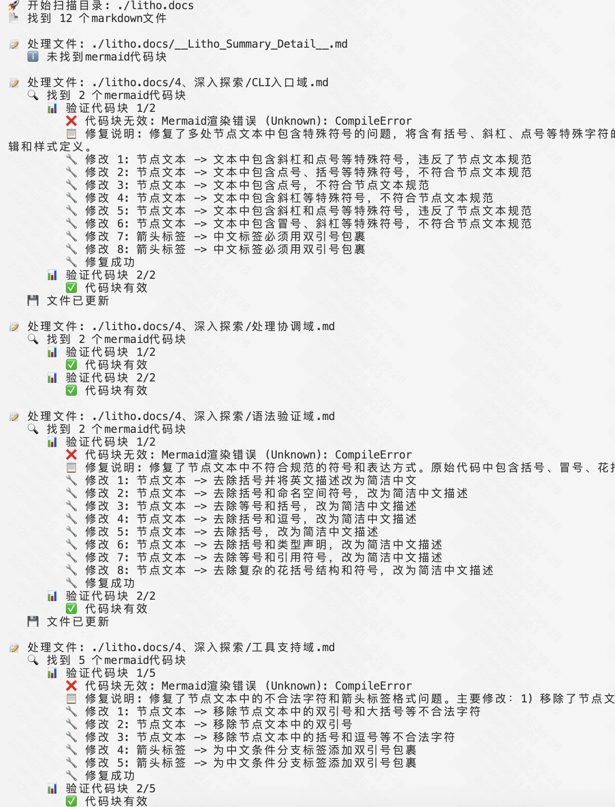
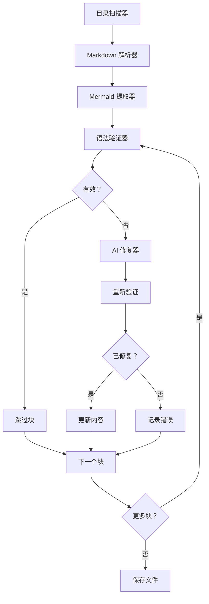
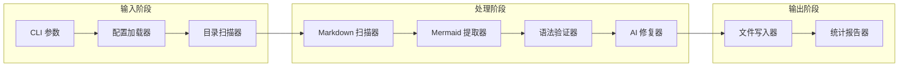
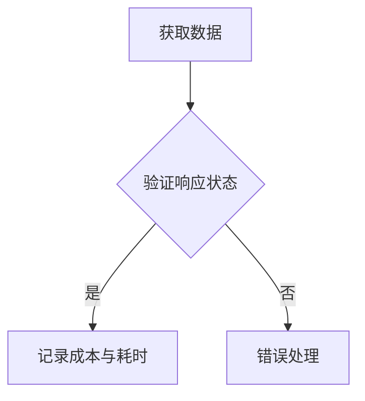
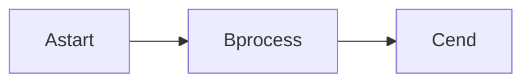
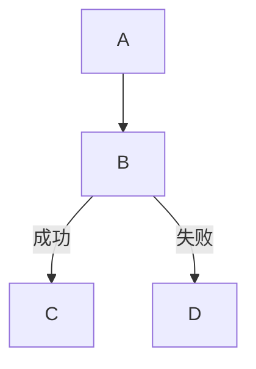

<p align="center">
<p align="center">
  
</p>
<h3 align="center">Mermaid Fixer</h3>

<p align="center">
    <a href="./README.md">English</a>
    |
    <a href="./README_zh.md">中文</a>
</p>

<p align="center">🔧 基于 <strong>Rust</strong> 构建的高性能 <strong>AI 驱动</strong> Mermaid 图表语法修复工具</p>
<p align="center">📊 自动检测并修复 <strong>Markdown 文件</strong> 中 Mermaid 图表的语法错误</p>
<p align="center">
  <a href="./docs/1、项目概述.md"></a>
  <a href="https://crates.io/crates/mermaid-fixer"></a>
  <a href=""></a>
  
</p>
<hr />

> 🚀 通过 [GitHub 赞助](https://github.com/sponsors/sopaco) 帮助我更好地开发这个软件

# 👋 什么是 Mermaid Fixer

**Mermaid Fixer** 是一个高性能的 AI 驱动工具，能够自动检测并修复 Markdown 文件中 Mermaid 图表的语法错误。基于 Rust 构建，确保性能和可靠性，Mermaid Fixer 帮助团队以最小的努力维护准确且有效的 Mermaid 图表。

**Mermaid Fixer** 采用多阶段工作流程，结合静态语法验证和 AI 智能修复。系统使用 mermaid-rs 库进行精确的语法验证，并集成大语言模型 (LLM) 来智能修复损坏的图表，同时保持其原始意图和结构。

# 😺 为什么使用 Mermaid Fixer

- 节省手动调试图表的时间
- 保持 Mermaid 图表语法正确
- 自动维护文档质量
- 智能修复复杂的语法问题

🌟 **适用于：**
- 技术文档团队
- 包含图表的开源项目
- 企业软件开发者
- 任何在 Markdown 中使用 Mermaid 的人！

# 👀 运行效果
<div style="text-align: center;">
  <table style="width: 100%; margin: 0 auto;">
    <tr>
      <td style="width: 50%;"></td>
      <td style="width: 50%;"></td>
    </tr>
  </table>
</div>

❤️ 喜欢 **Mermaid Fixer**？给它一个星标 🌟 或者 [赞助我](https://github.com/sponsors/sopaco)！ ❤️

# 🌠 功能特性

### 核心功能

- **自动扫描**：递归扫描目录中的 Markdown 文件
- **精确检测**：通过JS沙盒环境渲染Mermaid 进行准确的语法验证
- **AI 智能修复**：利用 LLM 智能修复语法错误
- **全面报告**：提供详细的修复前后对比
- **灵活配置**：支持多种 LLM 提供商和自定义设置

### 高级功能

- 试运行模式，安全测试
- 详细日志记录，深入了解
- 可配置的超时和重试机制
- 支持各种 Mermaid 图表类型
- 智能节点 ID 规范化
- 智能文本标签清理

## 💡 解决的问题

**Mermaid 图表困境：**
- 无法渲染的损坏图表
- 耗时的手动语法调试
- 不一致的图表格式
- 难以记住的复杂语法规则

**Mermaid Fixer 的解决方案：**
- 自动检测语法错误
- 智能修复损坏的图表
- 在修复语法的同时保持图表语义
- 提供清晰的更改反馈

# 🧠 工作原理

**Mermaid Fixer** 的处理工作流程分为六个不同的阶段：扫描、提取、验证、修复、重新验证和保存。每个阶段都针对性能和准确性进行了优化。

## 六阶段处理流水线

1. **扫描阶段**：递归发现目标目录中的所有 Markdown 文件
2. **提取阶段**：解析 Markdown 文件并提取 Mermaid 代码块
3. **验证阶段**：使用 mermaid-rs 验证每个图表的语法
4. **修复阶段**：使用 AI 修复无效图表，同时保持意图
5. **重新验证阶段**：确保修复后的图表语法正确
6. **保存阶段**：使用修正后的图表更新文件

### 处理工作流程



### 架构概览



# 🖥 快速开始

### 前置要求
- [**Rust**](https://www.rust-lang.org) (版本 1.70 或更高)
- [**Cargo**](https://doc.rust-lang.org/cargo/)
- 互联网连接（用于 LLM 集成）
- LLM API 密钥（OpenAI 等）

### 安装

#### 选项 1：从 crates.io 安装（推荐）

```sh
cargo install mermaid-fixer
```

安装后，您可以直接使用 `mermaid-fixer` 命令：

```sh
mermaid-fixer --help
```

#### 选项 2：从源码构建

1. 克隆仓库：
    ```sh
    git clone https://github.com/sopaco/mermaid-fixer.git
    ```
2. 进入项目目录：
    ```sh
    cd mermaid-fixer
    ```
3. 构建项目：
    ```sh
    cargo build --release
    ```
4. 编译后的二进制文件将在 `target/release` 目录中可用。

# 🚀 使用方法

**Mermaid Fixer** 提供命令行界面来修复 Mermaid 图表。以下是一些基本使用示例：

### 基本命令

```sh
# 修复当前目录中的 Mermaid 图表
mermaid-fixer -d .

# 扫描特定目录
mermaid-fixer -d /path/to/your/docs

# 试运行（仅检测，不修复）
mermaid-fixer -d ./docs --dry-run

# 详细输出
mermaid-fixer -d ./docs --verbose
```

### 配置

在项目根目录创建 `config.toml` 文件：

```toml
[llm]
provider = "openai"
model = "gpt-4"
api_key = "your-api-key-here"  # 或通过环境变量设置
max_tokens = 4000
temperature = 0.1

[mermaid]
timeout_seconds = 30
max_retries = 3
```

### 高级选项

```sh
# 自定义 LLM 配置
mermaid-fixer -d ./docs --llm-provider openai --llm-model gpt-5-mini --max-tokens 8192

# 自定义重试次数
mermaid-fixer -d ./docs --max-retries 5

# 自定义配置文件
mermaid-fixer -d ./docs --config custom-config.toml
```

## 📋 命令行选项

### 基本选项
- `-d, --directory <DIR>`：要扫描的目标目录（必需）
- `-c, --config <FILE>`：配置文件路径（默认：config.toml）
- `--dry-run`：仅检测问题，不执行修复
- `-v, --verbose`：启用详细日志输出

### LLM 配置选项
- `--llm-provider <PROVIDER>`：LLM 提供商（openai, mistral, deepseek等）
- `--llm-model <MODEL>`：LLM 模型名称
- `--llm-api-key <KEY>`：LLM API 密钥
- `--llm-base-url <URL>`：LLM API 基础 URL
- `--max-tokens <NUM>`：最大令牌数
- `--temperature <NUM>`：温度参数（0.0-1.0）

### Mermaid 配置选项
- `--timeout-seconds <NUM>`：Mermaid 验证超时（秒）
- `--max-retries <NUM>`：最大重试次数

### 帮助选项
- `-h, --help`：显示帮助信息
- `-V, --version`：显示版本信息

## 🔄 处理工作流程

1. **扫描阶段**：递归扫描指定目录中的 `.md` 和 `.markdown` 文件
2. **提取阶段**：从 Markdown 文件中提取 Mermaid 代码块
3. **验证阶段**：使用 mermaid-rs 验证每个代码块的语法
4. **修复阶段**：使用 AI 修复无效的代码块
5. **重新验证**：验证修复后的代码语法正确
6. **保存**：将修正后的内容写回原始文件

## 📈 输出统计

处理完成后，Mermaid Fixer 提供全面的统计信息。

## 📊 支持的修复类型

- ✅ 节点 ID 规范化（移除特殊字符，确保有效命名）
- ✅ 节点文本清理（移除括号中的特殊符号）
- ✅ 箭头标签规范化（为中文标签加引号）
- ✅ 语法结构修复（图表类型声明、箭头语法）
- ✅ 样式声明修复（颜色格式、属性语法）

## 🔧 修复示例

### 修复前


### 修复后


### 更多示例

#### 节点 ID 问题


#### 箭头标签问题


## 🚨 重要注意事项

- 确保稳定的互联网连接以访问 LLM API
- 处理大量文件可能产生 API 费用
- 建议在重要文档上首先使用 `--dry-run` 模式
- 工具自动跳过常见的构建目录（`node_modules`、`target` 等）
- 在对关键文档运行修复之前备份您的文件

## 🔍 故障排除

### 调试模式

启用详细日志记录进行详细故障排除：
```bash
mermaid-fixer -d ./docs --verbose
```

# 🤝 贡献

通过 [GitHub Issues](https://github.com/sopaco/mermaid-fixer/issues) 报告错误或提交功能请求来帮助改进 Mermaid Fixer。

## 贡献方式

- **语法模式增强**：改进各种 Mermaid 语法错误的检测
- **AI 提示优化**：增强 AI 修复提示以获得更好的结果
- **LLM 提供商支持**：添加对其他 LLM 提供商的支持
- **性能优化**：提高处理速度和内存使用
- **测试覆盖**：为各种图表类型添加全面的测试用例
- **文档**：改进文档和示例

# ⚛️ 开发技术栈

- [rust](https://github.com/rust-lang/rust) - 系统编程语言，注重性能和安全性
- [mermaid-rs](https://crates.io/crates/mermaid-rs) - Mermaid 语法验证库
- [clap](https://github.com/clap-rs/clap) - 命令行参数解析器
- [serde](https://github.com/serde-rs/serde) - 序列化框架
- [tokio](https://github.com/tokio-rs/tokio) - Rust 异步运行时
- [reqwest](https://github.com/seanmonstar/reqwest) - 用于 LLM API 调用的 HTTP 客户端

# 🪪 许可证
**MIT**。许可证副本在 [LICENSE](./LICENSE) 文件中提供。

# 👨 关于我

> 🚀 通过 [GitHub 赞助](https://github.com/sponsors/sopaco) 帮助我更好地开发这个软件

一位经验丰富的软件开发者，热衷于开发者工具和自动化。目前专注于构建提高开发者生产力和代码质量的高性能工具。

GitHub: [sopaco](https://github.com/sopaco)
