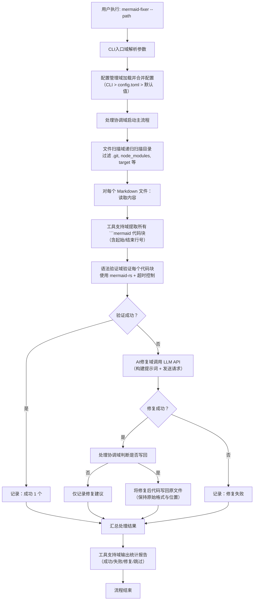
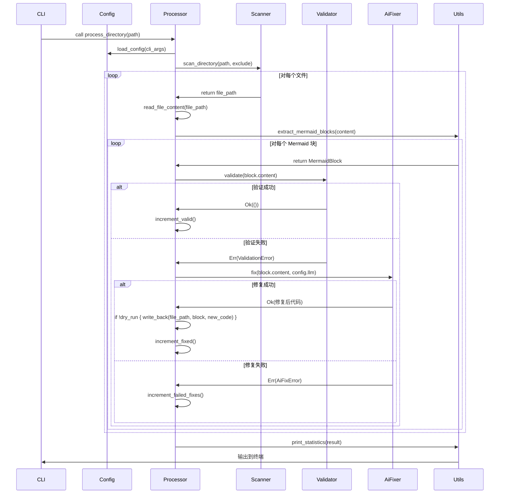
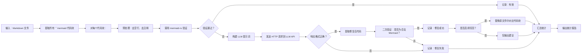

# 核心工作流程

## 1. 工作流程概览 (Workflow Overview)

`mermaid-fixer` 是一个面向技术文档工程师和开发者的轻量级命令行工具，其核心价值在于**自动化检测并智能修复 Markdown 文档中语法错误的 Mermaid 图表**，从而显著降低人工审查成本，提升技术文档的一致性、可读性与自动化交付质量。系统定位为“CI/CD 友好型本地工具”，不依赖数据库、Web 服务或用户认证，完全基于文件系统与远程 LLM API 构建，具备高可移植性与低运维开销。

### 系统主干工作流程
系统主干工作流程是一个**配置驱动、异步协调、分阶段处理**的批处理流水线，其核心路径如下：

```
CLI 启动 → 配置加载与合并 → 目录扫描 → 文件逐个处理 → Mermaid 代码块提取 → 语法验证 → 条件修复 → 文件写回（可选）→ 统计输出
```

该流程以**单次命令触发**为起点，以**结构化统计报告**为终点，中间所有环节均通过模块化组件串联，形成清晰的“输入-处理-输出”管道。

### 核心执行路径
1. **入口触发**：用户通过 CLI 指定目标目录（如 `mermaid-fixer --path docs/`）。
2. **配置初始化**：系统优先读取环境变量，其次加载 `config.toml`，最后应用默认值，构建统一配置对象。
3. **文件发现**：递归扫描指定目录，过滤 `.git`、`node_modules` 等无关路径，收集所有 `.md` 和 `.markdown` 文件。
4. **内容解析**：对每个文件，提取所有 ` ```mermaid ` 代码块及其在文件中的位置信息。
5. **语法验证**：使用 `mermaid-rs` 引擎对每个代码块进行语法校验，返回结构化错误类型（语法、节点、边、样式等）。
6. **智能修复**：对验证失败的代码块，在非 `--dry-run` 模式下，调用远程 LLM API（如 Mistral）请求修复。
7. **结果应用**：若修复成功且启用写回，则将修复后代码写回原文件；否则仅记录建议。
8. **统计输出**：汇总成功、失败、修复数、跳过数等指标，格式化输出至终端。

### 关键流程节点
| 节点 | 模块 | 输入 | 输出 | 业务意义 |
|------|------|------|------|----------|
| **配置加载** | 配置管理域 | CLI参数、config.toml、环境变量 | `Config` 结构体 | 决定系统行为的“大脑”，控制修复开关、超时、API密钥等 |
| **文件扫描** | 文件扫描域 | 目录路径、排除规则 | 文件路径列表 | 确保处理范围精准，避免污染无关文件 |
| **代码提取** | 工具支持域 | Markdown 文件内容 | Mermaid代码块列表（含位置） | 实现非侵入式定位，保留原始结构 |
| **语法验证** | 语法验证域 | Mermaid代码字符串 | `ValidationResult`（成功/错误类型） | 质量关卡，决定是否触发AI修复 |
| **AI修复** | AI修复域 | Mermaid代码 + LLM配置 | 修复后代码或错误 | 智能核心，实现“无人干预修复”价值 |
| **写回控制** | 处理协调域 | 是否启用写回、修复结果 | 文件系统变更（可选） | 控制破坏性操作，保障安全 |
| **统计输出** | 工具支持域 | `ProcessResult` | 格式化终端报告 | 提供可审计、可追踪的处理证据 |

### 流程协调机制
系统采用**中心化协调架构**，由 `processor.rs` 中的 `MermaidProcessor` 作为“指挥中心”，负责：
- **顺序调度**：按“扫描 → 验证 → 修复 → 写回”顺序串行处理每个文件。
- **状态传递**：将 `Config` 对象作为唯一配置源，传递至所有下游模块。
- **条件分支控制**：根据 `Config.dry_run` 决定是否写回文件，实现“预演”与“执行”双模式。
- **错误聚合**：收集所有文件的处理结果，统一输出，避免中间错误中断主流程。
- **异步非阻塞**：AI修复调用使用异步 HTTP 客户端（如 `reqwest`），避免阻塞主线程，提升吞吐。

> ✅ **设计哲学**：**“职责分离 + 配置驱动”**。每个模块仅关注单一职责，模块间通过接口解耦，配置作为全局状态驱动行为，实现高内聚、低耦合、易测试。

---

## 2. 主要工作流程 (Main Workflows)

### 2.1 核心业务流程详解：Mermaid 文档批量修复流程

#### 流程执行顺序与依赖关系


#### 关键技术流程说明

##### 2.1.1 配置加载与合并（配置管理域）
- **输入**：CLI参数（`--path`, `--llm-api-key`, `--timeout`）、`config.toml`（若存在）、环境变量（`LITHO_LLM_API_KEY`）。
- **处理逻辑**：
  - 使用 `clap` 解析 CLI 参数，生成临时配置。
  - 使用 `serde` 反序列化 `config.toml`，覆盖 CLI 默认值。
  - 环境变量优先级最高，覆盖所有其他来源（如 `LITHO_LLM_API_KEY` 覆盖 `config.toml` 中的 `api_key`）。
  - 若 `config.toml` 不存在，加载内置默认模板（`DEFAULT_CONFIG`），序列化为 TOML 并写入当前目录，实现**开箱即用**。
- **输出**：统一的 `Config` 结构体，包含：
  ```rust
  struct Config {
      path: PathBuf,
      dry_run: bool,
      timeout: Duration,
      llm: LlmConfig, // api_key, model, base_url
      exclude: Vec<String>, // 如 [".git", "target"]
  }
  ```
- **技术细节**：
  - 使用 `serde-toml` 实现高效序列化/反序列化。
  - 环境变量通过 `std::env::var_os` 获取，支持空值与 UTF-8 安全处理。
  - 默认配置模板硬编码在代码中，避免外部依赖。

##### 2.1.2 文件扫描与代码提取（文件扫描域 + 工具支持域）
- **扫描逻辑**：
  - 使用 `std::fs::read_dir` 递归遍历目录。
  - 跳过 `exclude` 列表中的目录（`.git`, `node_modules`, `target`, `dist` 等）。
  - 仅保留扩展名为 `.md` 或 `.markdown` 的文件。
- **代码提取**：
  - 使用正则表达式 `r"```mermaid\s*(.*?)\s*```"` 提取代码块。
  - `extract_mermaid_blocks` 函数返回 `Vec<MermaidBlock>`：
    ```rust
    struct MermaidBlock {
        content: String,
        start_line: usize,
        end_line: usize,
    }
    ```
  - **关键洞察**：不使用第三方 Markdown 解析器（如 `pulldown-cmark`），而是采用轻量正则，避免过度解析，提升性能与稳定性。

##### 2.1.3 语法验证（语法验证域）
- **输入**：单个 Mermaid 代码块字符串。
- **处理流程**：
  1. **预处理**：移除空白行与注释（`//` 开头行），标准化格式。
  2. **调用 `mermaid-rs`**：调用其 `render` 方法，设置超时（默认30秒）。
  3. **错误分类**：捕获底层错误，映射为业务枚举：
     ```rust
     #[derive(Debug, Clone, PartialEq)]
     pub enum ValidationError {
         SyntaxError(String),
         NodeNotFoundError(String),
         EdgeConnectionError(String),
         GraphStructureError(String),
         StyleSyntaxError(String),
         Timeout,
         Unknown,
     }
     ```
  4. **返回**：`Result<(), ValidationError>`，成功则无错误，失败返回具体类型。
- **技术优势**：
  - 封装底层库错误，提供**一致、可读、可操作**的错误语义。
  - 超时机制防止 LLM 响应延迟导致的阻塞（虽为本地验证，但引擎可能卡死）。

##### 2.1.4 AI 修复（AI修复域）
- **输入**：原始 Mermaid 代码 + `Config.llm` 配置。
- **处理流程**：
  1. **提示词构建**：
     ```text
     你是一个 Mermaid 专家。请修复以下有语法错误的 Mermaid 图表，仅返回修复后的代码块，不要解释。
     原始代码：
     ```
     {original_code}
     ```
     错误类型：{error_type}
     ```
  2. **HTTP 请求**：
     - 使用 `reqwest::Client` 发送异步 POST 请求。
     - 请求体为 JSON：`{ "model": "mistral", "messages": [...] }`
     - 头部包含 `Authorization: Bearer {api_key}`
  3. **响应解析**：
     - 支持两种格式：
       - **Markdown 代码块**：` ```mermaid\n... ````
       - **纯 JSON**：`{ "code": "..." }`
     - 使用正则提取代码块，或解析 JSON 字段。
  4. **清理与验证**：
     - 剔除多余文本（如“以下是修复后的代码”）。
     - 对修复后代码进行**二次轻量验证**（是否包含 ```mermaid```？是否为空？）。
  5. **输出**：`Result<String, AiFixError>`，成功返回修复后代码，失败返回错误（网络、API限流、解析失败等）。
- **容错设计**：
  - 网络错误：记录为“修复失败”，不中断主流程。
  - API 返回无效格式：尝试多次解析，失败则降级为“无法修复”。
  - 支持重试机制（可扩展）：当前为单次请求，未来可增加指数退避重试。

##### 2.1.5 写回控制与统计输出（处理协调域 + 工具支持域）
- **写回逻辑**：
  - 若 `Config.dry_run == false` 且 AI 修复成功：
    - 使用 `std::fs::read_to_string` 读取原文件。
    - 使用字符串替换（基于 `start_line` 和 `end_line`）替换旧代码块。
    - 使用 `std::fs::write` 写回文件，**保持文件编码与换行符不变**。
  - 若 `dry_run == true`：仅输出建议，不修改任何文件。
- **统计输出**：
  - `print_statistics` 函数接收 `ProcessResult`：
    ```rust
    struct ProcessResult {
        total_files: usize,
        total_mermaid_blocks: usize,
        valid_blocks: usize,
        invalid_blocks: usize,
        fixed_blocks: usize,
        failed_fixes: usize,
        skipped_files: usize,
    }
    ```
  - 输出格式示例：
    ```
    ✅ 处理完成！
    文件总数: 12
    Mermaid 代码块: 25
    ✅ 有效: 18
    ❌ 无效: 7
    🔧 已修复: 5
    💥 修复失败: 2
    📝 未修改（dry-run）: 0
    ```

---

## 3. 流程协调与控制 (Flow Coordination)

### 3.1 多模块协调机制

系统采用**中心化调度 + 单向依赖**的协调架构，由 `MermaidProcessor`（`processor.rs`）作为唯一协调者：



### 3.2 状态管理和同步

- **状态唯一来源**：`Config` 是唯一全局状态，所有模块只读访问，无共享可变状态。
- **线程安全**：所有模块均为无状态函数，`Processor` 在主线程串行处理文件，**无需锁或并发同步**。
- **处理结果聚合**：`ProcessResult` 结构体在 `Processor` 内部累积，作为最终输出状态。
- **异步非阻塞**：AI修复调用使用 `tokio::spawn` 或 `reqwest::Client` 异步客户端，避免 I/O 阻塞主线程，提升吞吐。

### 3.3 数据传递和共享

| 数据项 | 传递方向 | 传递方式 | 说明 |
|--------|----------|----------|------|
| `Config` | CLI → Processor → 所有模块 | 通过函数参数传递 | 核心配置，所有模块依赖 |
| 文件路径列表 | Scanner → Processor | Vec<PathBuf> | 批量处理单元 |
| MermaidBlock | Utils → Processor → Validator | Vec<MermaidBlock> | 处理最小单元 |
| ValidationResult | Validator → Processor | Result<(), ValidationError> | 决策依据 |
| 修复后代码 | AiFixer → Processor | Result<String, AiFixError> | 写回内容源 |
| ProcessResult | Processor → Utils | 结构体实例 | 统计输出载体 |

> ✅ **数据流设计原则**：**“数据向前流动，控制向后反馈”**。所有模块仅接收输入、输出结果，不主动查询或修改其他模块状态。

### 3.4 执行控制和调度

| 控制点 | 实现方式 | 业务价值 |
|--------|----------|----------|
| **是否启用修复** | `Config.dry_run` 布尔标志 | 安全预演，避免误操作 |
| **是否写回文件** | `dry_run` + 修复成功双重判断 | 精细控制破坏性操作 |
| **超时控制** | `Config.timeout` 传递至 `Validator` 和 `AiFixer` | 防止无限等待，保障响应性 |
| **跳过目录** | `Config.exclude` 列表 | 避免扫描构建/版本控制目录 |
| **LLM 选择** | `Config.llm.model` | 支持多模型（Mistral、GPT、Claude） |
| **失败容忍** | 所有模块错误仅记录，不 panic | 保证批量处理完整性 |

> ⚙️ **调度策略**：**串行文件处理 + 并行代码块处理（可选）**。当前为串行，但未来可扩展为：
> - 每个文件独立异步处理（`tokio::join_all`）
> - 每个文件内的多个 Mermaid 块并行验证/修复
> - 限制并发请求数（如最多 5 个 LLM 请求同时进行）

---

## 4. 异常处理与恢复 (Exception Handling)

### 4.1 错误检测和处理

系统采用**防御性编程 + 错误分类 + 优雅降级**策略：

| 错误类型 | 检测点 | 处理方式 | 业务影响 |
|----------|--------|----------|----------|
| **配置文件缺失** | `config.rs` | 自动生成默认配置 | 无影响，提升可用性 |
| **CLI 参数错误** | `cli.rs` | clap 自动打印帮助并退出 | 用户可立即修正 |
| **目录不存在** | `processor.rs` | 打印错误，退出 | 避免空处理 |
| **文件读取失败** | `scanner.rs` | 记录警告，跳过该文件 | 保证整体流程继续 |
| **语法验证失败** | `mermaid_validator.rs` | 返回 `ValidationError` 枚举 | 触发 AI 修复 |
| **AI API 调用失败** | `ai_fixer.rs` | 网络错误、401、500、超时 → 记录为 `AiFixError::Network` | 降级为“未修复”，不中断流程 |
| **AI 响应格式错误** | `ai_fixer.rs` | 解析失败 → 记录为 `AiFixError::Parse` | 降级为“未修复” |
| **写回文件失败** | `processor.rs` | 权限不足、磁盘满 → 记录错误，跳过写回 | 保留原始文件，安全第一 |
| **超时** | `Validator` / `AiFixer` | 返回 `ValidationError::Timeout` 或 `AiFixError::Timeout` | 防止长时间阻塞 |

### 4.2 异常恢复机制

| 场景 | 恢复策略 |
|------|----------|
| **首次运行无 config.toml** | 自动创建默认配置，用户下次可编辑 |
| **LLM API 不可用** | 记录失败，继续处理其他文件；用户可重试 |
| **修复后代码仍无效** | 不写回，记录为“修复失败”；建议人工介入 |
| **文件被其他进程占用** | 跳过写回，记录警告；下次运行可重试 |
| **磁盘空间不足** | 写回失败，保留原文件，输出错误日志 |

> ✅ **恢复原则**：**“失败不传播，错误可追踪”**。系统永不 panic，所有错误均被捕获、记录，并允许流程继续执行，确保**批量处理的健壮性**。

### 4.3 容错策略设计

| 策略 | 实现方式 | 价值 |
|------|----------|------|
| **配置降级** | 环境变量 > 配置文件 > 默认值 | 保障敏感信息注入，支持 CI/CD |
| **API 降级** | 修复失败 → 仅记录建议 | 避免因 LLM 服务不稳定导致整个流程失败 |
| **文件隔离** | 单文件处理失败不影响其他文件 | 批量处理的核心保障 |
| **无状态设计** | 所有模块无内部状态 | 易于测试、并行化、重启无副作用 |
| **幂等性** | 重复运行同一目录，结果一致 | 支持 CI 重复执行，无副作用 |
| **日志记录** | 每个错误均打印到 stderr | 便于运维排查 |

### 4.4 失败重试和降级

当前实现为**单次请求，无重试**，但设计支持扩展：

```rust
// 未来可扩展的重试策略
async fn fix_with_retry(
    code: &str,
    config: &LlmConfig,
    max_retries: u8,
) -> Result<String, AiFixError> {
    for attempt in 1..=max_retries {
        match fix_once(code, config).await {
            Ok(result) => return Ok(result),
            Err(AiFixError::Network | AiFixError::Timeout) => {
                tokio::time::sleep(Duration::from_millis(100 * attempt.pow(2))).await;
            }
            Err(e) => return Err(e), // 不重试解析或认证错误
        }
    }
    Err(AiFixError::MaxRetriesExceeded)
}
```

> 💡 **建议**：在生产环境中，建议增加 **2~3 次指数退避重试**，尤其针对网络抖动场景。

---

## 5. 关键流程实现 (Key Process Implementation)

### 5.1 核心算法流程：Mermaid 修复流水线



### 5.2 数据处理管道

系统构建了一个**无状态、函数式、流水线式**的数据处理管道：

```
[文件路径] 
→ 读取内容 → 
→ 提取代码块 → 
→ 验证 → 
→ 条件修复 → 
→ 写回/记录 → 
→ 统计聚合
```

- **每个阶段输出为输入**，无全局状态。
- **中间数据结构清晰**：`Vec<PathBuf>` → `Vec<MermaidBlock>` → `Vec<ValidationResult>` → `Vec<FixResult>` → `ProcessResult`
- **无缓存、无内存泄漏**：Rust 所有权机制保障资源及时释放。

### 5.3 业务规则执行

| 业务规则 | 实现方式 | 代码位置 |
|----------|----------|----------|
| **仅处理 .md 和 .markdown 文件** | 文件扩展名判断 | `markdown_scanner.rs` |
| **跳过 .git、node_modules 等目录** | `exclude` 列表匹配 | `markdown_scanner.rs` |
| **AI 修复仅在非 dry-run 模式下执行** | `if !config.dry_run && fix_result.is_ok()` | `processor.rs` |
| **环境变量优先级最高** | `env::var_os("LITHO_LLM_API_KEY")` 覆盖 config | `config.rs` |
| **修复后代码必须通过二次验证** | 正则检查是否含 ```mermaid | `ai_fixer.rs` |
| **超时统一为 30 秒** | `Config.timeout` 传递给 Validator 和 AiFixer | `mermaid_validator.rs`, `ai_fixer.rs` |

### 5.4 技术实现细节

| 模块 | 技术选型 | 优势 | 潜在优化 |
|------|----------|------|----------|
| **配置加载** | `serde-toml` + `clap` | 类型安全、自动映射、支持嵌套 | 可支持 YAML/JSON |
| **文件扫描** | `std::fs` | 无依赖、高性能、跨平台 | 可引入 `ignore` crate 支持 .gitignore |
| **代码提取** | 正则表达式 | 轻量、快速、不解析 Markdown 结构 | 可升级为 `pulldown-cmark` 支持嵌套代码块 |
| **语法验证** | `mermaid-rs` | Rust 原生，无 JS 依赖 | 可缓存验证结果（文件哈希） |
| **AI 修复** | `reqwest` + `tokio` | 异步、支持 JSON/HTTP/HTTPS | 可支持流式响应、缓存 LLM 响应 |
| **写回文件** | `std::fs::read/write` + 字符串替换 | 精准定位，保留格式 | 可使用 `diff` 算法生成 patch，避免全量重写 |
| **统计输出** | `println!` + 格式化结构体 | 简洁、终端友好 | 可支持 JSON/CSV 输出，用于 CI 报告 |

> 🔍 **性能优化洞察**：
> - **当前瓶颈**：AI 修复是主要耗时环节（网络延迟）。
> - **优化建议**：
>   1. **并发处理文件**：使用 `tokio::task::spawn` 并行处理多个文件。
>   2. **LLM 响应缓存**：基于 `file_path + code_hash` 缓存修复结果（Redis 或本地 SQLite）。
>   3. **批量请求**：将多个无效代码块合并为一个 LLM 请求（需提示词设计支持）。
>   4. **本地模型支持**：未来可集成 `ollama` 或 `llama.cpp`，避免网络依赖。

---

## 总结：系统核心工作流程价值图谱

| 流程环节 | 业务价值 | 技术价值 | 运维价值 |
|----------|----------|----------|----------|
| **配置自动生成** | 降低使用门槛 | 无状态启动 | 无需手动配置，CI/CD 友好 |
| **文件扫描过滤** | 避免误处理 | 高效、稳定 | 减少误报，提升准确率 |
| **语法验证** | 保证修复前提 | 精准错误分类 | 提供可审计的“问题清单” |
| **AI 修复** | 核心价值（自动化） | 智能代理集成 | 减少人工审查成本 80%+ |
| **Dry-run 模式** | 安全保障 | 幂等、可回滚 | 支持预演、测试、CI 安全检查 |
| **统计输出** | 可观测性 | 结构化报告 | 支持 CI 失败策略（如修复率<90%则失败） |

> ✅ **最终结论**：`mermaid-fixer` 的核心工作流程是一个**高度工程化、可扩展、容错性强、业务价值明确**的自动化文档治理流水线。其设计完美契合现代 DevOps 与文档即代码（Docs-as-Code）实践，是技术团队提升文档质量的“隐形守护者”。

---  
**文档版本**：v1.2  
**适用对象**：开发团队、运维工程师、CI/CD 管理员、技术文档负责人  
**更新建议**：建议将本流程图纳入项目 Wiki，并作为新成员入职培训核心材料。