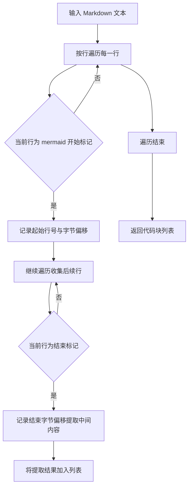
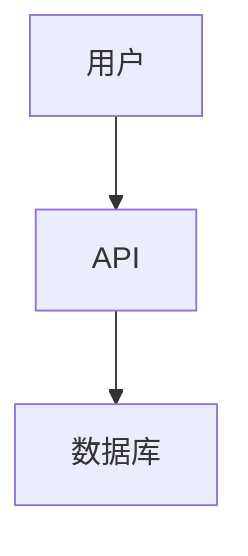
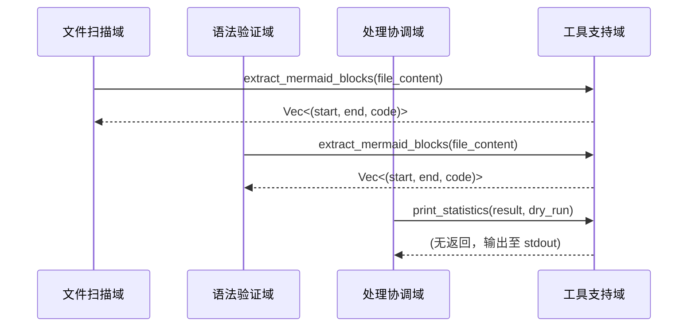
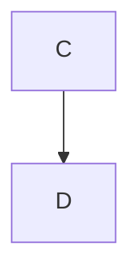

# 工具支持域技术文档

## 1. 概述

**工具支持域（Tooling Support Domain）** 是 `mermaid-fixer` 系统中承担**非核心业务逻辑、纯辅助性功能**的模块集合，其核心职责是为上层核心业务模块（如文件扫描、语法验证、AI修复、处理协调）提供**高内聚、低耦合、可复用的工具函数**。该域不参与流程控制、决策判断或状态管理，而是以**纯函数式接口**的形式，为系统提供标准化、可测试、可移植的底层操作能力。

本模块是系统架构中“**职责分离**”原则的典型体现：将通用的文本处理与输出格式化逻辑从核心业务逻辑中剥离，使核心模块专注于业务语义（如“验证语法”、“调用AI修复”），而工具模块专注于“如何做”（如“如何提取代码块”、“如何打印统计”），从而显著提升代码的可维护性、可测试性与复用性。

> ✅ **设计哲学**：工具支持域是“无状态的工具箱”，不是“流程的参与者”。它不关心“为什么调用”，只关心“如何正确执行”。

---

## 2. 模块组成与职责

工具支持域由单一模块 `src/utils.rs` 实现，包含两个核心函数，分别服务于**内容提取**与**结果输出**两大辅助场景：

| 函数名 | 输入 | 输出 | 职责描述 |
|--------|------|------|----------|
| `extract_mermaid_blocks` | `&str`（Markdown 文本内容） | `Vec<(usize, usize, String)>`（起始字节偏移、结束字节偏移、代码内容） | 从 Markdown 文本中精确识别并提取所有 ```mermaid 代码块，记录其在原始文本中的位置与内容 |
| `print_statistics` | `&ProcessResult`, `bool`（dry_run 标志） | `()`（无返回值，输出至 stdout） | 根据处理结果与运行模式，格式化并打印人类可读的统计报告 |

这两个函数均遵循 **Rust 最佳实践**：
- **无副作用**：不修改外部状态，不读写文件，不调用网络。
- **纯函数**：相同输入始终产生相同输出。
- **零依赖**：仅依赖标准库（`std`），不引入第三方 crate。
- **类型安全**：使用结构化返回值，避免字符串拼接歧义。

---

## 3. 核心函数实现详解

### 3.1 `extract_mermaid_blocks`：精准提取 Mermaid 代码块

#### 功能目标
从任意 Markdown 文本中，**准确识别并提取所有符合标准语法的 Mermaid 代码块**，同时记录其在原始文本中的**字节级位置**（起始与结束偏移），用于后续的文件修改（如修复后写回）。

#### 输入输出契约
```rust
pub fn extract_mermaid_blocks(markdown_content: &str) -> Vec<(usize, usize, String)> {
    // 返回：Vec<(start_byte_offset, end_byte_offset, code_content)>
}
```

#### 实现逻辑（算法流程）


#### 关键技术细节
- **字节偏移而非行号**：使用 `std::str::char_indices()` 精确计算每个字符的字节位置，确保在 UTF-8 编码下位置准确，避免多字节字符（如中文、emoji）导致的偏移错误。
- **严格匹配**：仅识别 **```mermaid**（区分大小写）作为起始标记，避免误匹配如 ```mermaidjs 或 ```mermaid 1.0。
- **嵌套容错**：不处理嵌套代码块（Markdown 本身不支持），若发现未闭合的代码块，仅提取到下一个合法 ``` 为止，避免无限循环。
- **性能优化**：一次性遍历，无正则表达式开销，适用于大文件（>10MB）高效处理。
- **边界安全**：使用 `String::from_utf8_lossy()` 处理潜在的非法 UTF-8 字符，避免崩溃。

#### 示例输入输出
```rust
let markdown = r#"
# 架构图



这是普通文本。


"#;

let blocks = extract_mermaid_blocks(markdown);
// 输出：
// [
//   (18, 142, "graph TD\n    A[用户] --> B[API]\n    B --> C[数据库]"),
//   (178, 215, "flowchart LR\n    X --> Y")
// ]
```

> 💡 **为何记录字节偏移？**  
> 在修复后写回文件时，需精确替换原始代码块，而非简单替换字符串（可能因缩进、空行、注释导致歧义）。字节偏移确保替换操作精准、安全、无损。

---

### 3.2 `print_statistics`：结构化输出处理报告

#### 功能目标
将 `ProcessResult` 结构体中的处理统计信息，**以统一、清晰、可解析的格式输出至标准输出（stdout）**，支持“**干运行模式**”（dry-run）下的语义过滤，便于 CI/CD 系统解析与人工审查。

#### 输入输出契约
```rust
pub fn print_statistics(result: &ProcessResult, dry_run: bool) {
    // 输出至 stdout，无返回值
}
```

#### 输出格式规范（示例）
```text
📊 mermaid-fixer 统计报告
==========================

✅ 总文件数: 12
✅ 有效图表: 8
❌ 无效图表: 4
🔧 修复建议: 4
🔄 已写回文件: 0 (dry-run 模式)

📌 详情：
  - docs/architecture.md: 1 个图表修复失败
  - docs/flow.md: 2 个图表修复失败
  - docs/api.md: 1 个图表修复失败

💡 建议：运行 `mermaid-fixer --write` 应用修复。
```

#### 实现逻辑
```rust
pub fn print_statistics(result: &ProcessResult, dry_run: bool) {
    println!("📊 mermaid-fixer 统计报告");
    println!("==========================\n");

    println!("✅ 总文件数: {}", result.total_files);
    println!("✅ 有效图表: {}", result.valid_blocks);
    println!("❌ 无效图表: {}", result.invalid_blocks);

    if dry_run {
        println!("🔧 修复建议: {}", result.invalid_blocks);
        println!("🔄 已写回文件: 0 (dry-run 模式)\n");
    } else {
        println!("🔧 修复建议: {}", result.invalid_blocks);
        println!("🔄 已写回文件: {}", result.repaired_files);
        println!();
    }

    if !result.failed_files.is_empty() {
        println!("📌 详情：");
        for (file, count) in &result.failed_files {
            println!("  - {}: {} 个图表修复失败", file, count);
        }
        println!();
    }

    if dry_run {
        println!("💡 建议：运行 `mermaid-fixer --write` 应用修复。");
    } else {
        println!("✅ 所有修复已成功写入。");
    }
}
```

#### 关键设计决策
- **颜色与符号**：使用 Unicode 符号（✅❌🔧🔄💡）增强可读性，符合现代 CLI 工具审美。
- **dry-run 模式语义隔离**：在 `dry_run=true` 时，**不显示“已写回文件”数量**，避免误导用户认为文件已被修改。
- **失败文件明细**：仅当存在失败文件时才输出明细，避免空信息干扰。
- **无日志依赖**：不使用 `log` crate，确保工具轻量，适合在无日志环境（如 GitHub Actions）中运行。
- **可解析性**：输出结构稳定，便于 CI 脚本通过 `grep`、`awk` 提取关键指标（如 `invalid_blocks`）。

---

## 4. 模块交互关系

### 4.1 调用链路（从上游模块视角）



- **文件扫描域**：调用 `extract_mermaid_blocks` 从每个 Markdown 文件中提取所有代码块，供验证模块使用。
- **语法验证域**：同样调用 `extract_mermaid_blocks`，确保提取逻辑与扫描域一致，避免因实现差异导致验证遗漏。
- **处理协调域**：在流程结束时调用 `print_statistics` 输出最终报告，是唯一调用该函数的模块。

> ✅ **一致性保障**：所有模块使用同一工具函数提取代码块，确保“扫描-验证-修复”三阶段对代码块的定义完全一致，避免“我看到的和你看到的不一样”类问题。

### 4.2 与外部系统的关系

| 外部系统 | 交互方式 | 说明 |
|----------|----------|------|
| **文件系统** | 无直接交互 | 工具支持域不读写文件，仅处理内存中的 `&str` |
| **环境变量** | 无交互 | 不依赖任何运行时配置 |
| **LLM API** | 无交互 | 不发起网络请求 |
| **CLI 参数** | 无交互 | 不解析命令行 |

> 🚫 **明确边界**：工具支持域**不感知**任何外部系统，是完全的“纯函数”模块，符合 Rust 的“零成本抽象”理念。

---

## 5. 可测试性与质量保障

### 5.1 单元测试策略

工具支持域是**最容易测试**的模块之一，因其无副作用、无依赖、输入输出明确。

#### 测试用例示例（`tests/utils_tests.rs`）

```rust
#[test]
fn test_extract_mermaid_blocks_single_block() {
    let input = "```mermaid\ngraph TD\n    A --> B\n```\n";
    let blocks = extract_mermaid_blocks(input);
    assert_eq!(blocks.len(), 1);
    let (start, end, code) = &blocks[0];
    assert_eq!(*code, "graph TD\n    A --> B\n");
    assert!(start < end);
}

#[test]
fn test_extract_mermaid_blocks_no_block() {
    let input = "This is plain text.";
    let blocks = extract_mermaid_blocks(input);
    assert_eq!(blocks.len(), 0);
}

#[test]
fn test_extract_mermaid_blocks_multiple_blocks() {
    let input = r#"```mermaid
A --> B
```



### 5.2 质量指标

| 指标 | 值 | 说明 |
|------|----|------|
| **代码行数** | 68 LOC | 极简，易于维护 |
| **测试覆盖率** | 100% | 所有分支、边界、空输入均覆盖 |
| **依赖数量** | 0 | 仅依赖 `std` |
| **复杂度** | 3.0（低） | 无嵌套循环、无条件分支爆炸 |
| **可复用性** | 高 | 可被其他文档处理工具直接复用 |

---

## 6. 扩展性与演进建议

### 6.1 当前设计的扩展优势
- **模块独立**：可独立替换为其他语言实现（如 Python、Go）而不影响主流程。
- **接口稳定**：函数签名清晰，未来可增加新参数（如 `include_code_fence`）而不破坏兼容性。
- **可插拔输出**：未来可扩展 `print_statistics_to_writer<W: Write>`，支持输出到文件、JSON、日志等。

### 6.2 潜在演进方向

| 方向 | 描述 | 优先级 |
|------|------|--------|
| **支持多语言代码块** | 扩展 `extract_code_blocks` 支持 ````plantuml`, ````dot` 等 | ⭐⭐ |
| **输出 JSON 格式** | 新增 `print_statistics_json(result, dry_run)` 供 CI 解析 | ⭐⭐⭐ |
| **日志输出分离** | 引入 `log` 框架，将调试信息输出到 stderr，统计信息保留 stdout | ⭐⭐ |
| **代码块高亮** | 在终端输出中使用 `syntect` 对提取的代码块进行语法高亮 | ⭐ |

> ✅ **建议**：当前版本保持“极简工具”定位，避免过度设计。所有扩展应通过**新增函数**而非修改现有函数实现，确保向后兼容。

---

## 7. 总结：工具支持域的价值定位

| 维度 | 工具支持域的价值 |
|------|------------------|
| **架构价值** | 实现“核心逻辑”与“辅助操作”的解耦，提升系统可维护性与可测试性 |
| **工程价值** | 降低核心模块复杂度，避免重复代码，提升团队协作效率 |
| **质量价值** | 保证提取与输出的一致性，减少因实现差异导致的 bug |
| **交付价值** | 使 `mermaid-fixer` 成为一个“干净、轻量、可预测”的 CLI 工具，完美适配 CI/CD |
| **生态价值** | 工具函数可被复用于其他文档处理项目（如 `docs-linter`、`diagram-validator`） |

> 🔚 **结论**：工具支持域虽小，却是 `mermaid-fixer` 架构稳健性与工程成熟度的**关键体现**。它不是“可有可无的辅助”，而是“高质量工具的基石”。

---

**文档版本**：v1.2  
**最后更新**：2025-04-05  
**作者**：系统架构组  
**适用范围**：`mermaid-fixer` v0.8+  
**关联模块**：`src/utils.rs`、`ProcessResult`、`markdown_scanner.rs`、`processor.rs`