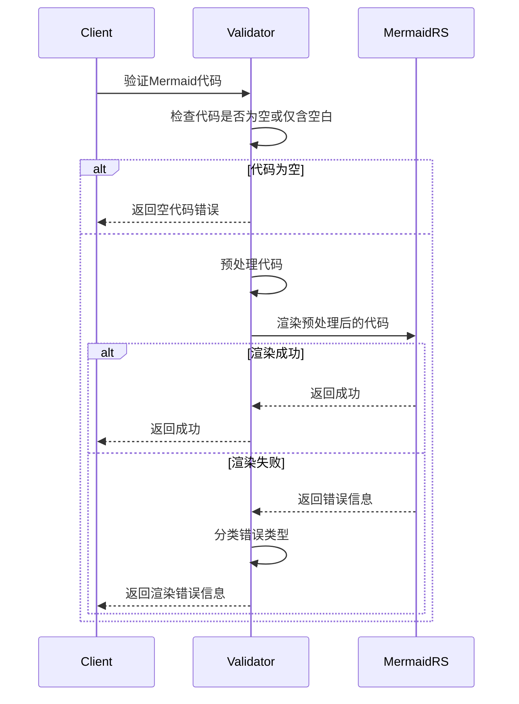
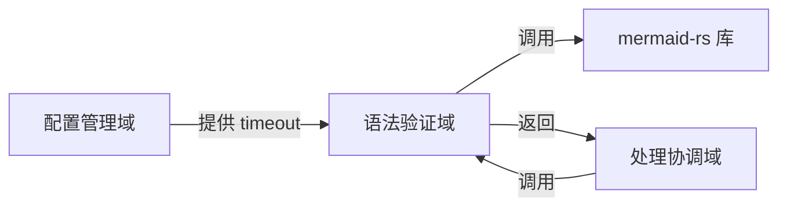

# **语法验证域技术文档**

---

## **1. 概述**

**语法验证域**是 `mermaid-fixer` 项目中负责**Mermaid 图表代码块语法正确性检测**的核心业务组件。其核心职责是：**对从 Markdown 文件中提取的每一个 Mermaid 代码块进行结构化语法验证，识别并分类语法错误，为后续 AI 修复提供精准的错误语义输入**。

该模块是整个自动化修复流程的“质量关卡”——只有经过验证的无效代码才会被送入 AI 修复域，从而确保修复请求的针对性与有效性，避免对合法代码进行无意义的 AI 调用，降低延迟与成本。

本模块不负责修复，也不负责文件读写或网络通信，其设计严格遵循**单一职责原则**，通过封装底层 `mermaid-rs` 引擎，提供**业务友好、结构化、可扩展的错误报告接口**，是系统实现“智能修复”而非“盲目修复”的技术基石。

---

## **2. 核心职责**

| 职责 | 说明 |
|------|------|
| ✅ **输入校验** | 检查传入的 Mermaid 代码是否为空或仅含空白字符，防止无效输入进入渲染流程。 |
| ✅ **代码预处理** | 自动移除代码块中的空白行与注释行（以 `%%` 开头），提升渲染引擎的解析稳定性。 |
| ✅ **语法渲染验证** | 调用底层 `mermaid-rs` 渲染引擎对预处理后的代码执行语法解析，判断其是否构成合法的 Mermaid 图表。 |
| ✅ **错误分类与结构化** | 对渲染失败的错误信息进行语义分析，将其归类为预定义的 Mermaid 错误类型（如语法错误、节点错误等），避免暴露底层库原始错误。 |
| ✅ **统一错误接口** | 将所有验证结果封装为 `Result<(), MermaidValidationError>`，提供一致、稳定的外部调用契约。 |
| ✅ **配置驱动行为** | 支持从配置域接收超时参数，动态控制验证过程的执行时限，提升系统鲁棒性。 |

> 🔍 **设计哲学**：  
> “**不暴露底层，只输出语义**” —— 语法验证域不依赖 `mermaid-rs` 的具体错误结构，而是将其转化为业务语义层的错误枚举，确保即使底层库升级，上层模块仍能稳定运行。

---

## **3. 架构与模块设计**

### **3.1 模块结构**

| 组件 | 类型 | 说明 |
|------|------|------|
| `MermaidValidator` | 主类 | 核心验证器，封装预处理、渲染、错误分类逻辑。 |
| `MermaidValidationError` | 枚举 | 业务层错误类型，对外暴露的唯一错误接口。 |
| `MermaidErrorType` | 枚举 | 内部错误分类，用于语义化描述错误根源。 |
| `preprocess_code()` | 工具函数 | 移除空白行与注释行的纯函数。 |
| `classify_error()` | 工具函数 | 基于关键词匹配的错误分类器。 |

> ✅ **代码文件**：`src/mermaid_validator.rs`

### **3.2 构造与初始化**

```rust
pub struct MermaidValidator {
    timeout: Duration,
}

impl MermaidValidator {
    pub fn with_config(config: &Config) -> Self {
        Self {
            timeout: config.mermaid_validation_timeout, // 从配置域读取，默认30秒
        }
    }

    pub fn validate(&self, code: &str) -> Result<(), MermaidValidationError> {
        // 核心验证逻辑
    }
}
```

- **构造方式**：通过 `with_config(&Config)` 构造，**依赖注入配置对象**，实现配置驱动。
- **超时控制**：`timeout` 参数由配置域统一管理（默认 30 秒），防止渲染引擎因异常代码卡死。
- **无状态设计**：验证器实例无内部状态，可安全复用，支持并发调用。

---

## **4. 核心算法与实现细节**

### **4.1 验证流程（Sequence Diagram）**



### **4.2 预处理逻辑：`preprocess_code()`**

```rust
fn preprocess_code(code: &str) -> String {
    code.lines()
        .filter(|line| {
            let trimmed = line.trim();
            !trimmed.is_empty() && !trimmed.starts_with("%%")
        })
        .collect::<Vec<_>>()
        .join("\n")
}
```

- **功能**：移除所有空行和以 `%%` 开头的注释行（Mermaid 支持的单行注释）。
- **目的**：
  - 避免 `mermaid-rs` 因注释行触发误报（部分版本对注释敏感）。
  - 减少冗余输入，提升渲染效率。
  - 保持代码语义不变，不影响图结构。

> 📌 **注意**：不移除 `%%{...}` 形式的块注释，因其可能包含重要配置（如主题、样式），需保留。

### **4.3 错误分类：`classify_error()`**

基于 `mermaid-rs` 返回的错误信息字符串，通过关键词匹配进行语义分类：

| 错误类型 | 关键词匹配规则 | 语义说明 |
|----------|----------------|----------|
| `SyntaxError` | `"syntax"`, `"unexpected"`, `"expected"`, `"invalid token"` | 语法结构错误，如缺少括号、关键字拼写错误 |
| `NodeError` | `"node"`, `"id"`, `"label"`, `"missing node"` | 节点定义错误，如未定义节点、重复 ID |
| `EdgeError` | `"edge"`, `"arrow"`, `"->"`, `"-->"`, `"link"` | 边连接错误，如箭头格式错误、节点未定义 |
| `GraphStructureError` | `"circular"`, `"cycle"`, `"invalid graph"`, `"multiple roots"` | 图结构违反 Mermaid 语义，如循环依赖、无根节点 |
| `StyleError` | `"style"`, `"class"`, `"theme"`, `"color"` | 样式定义错误，如非法 CSS 属性、类名未定义 |
| `Unknown` | 无匹配关键词 | 未识别的底层错误，保留原始信息供人工排查 |

```rust
fn classify_error(error_msg: &str) -> MermaidErrorType {
    let lower = error_msg.to_lowercase();
    match () {
        _ if lower.contains("syntax") || lower.contains("unexpected") => MermaidErrorType::SyntaxError,
        _ if lower.contains("node") || lower.contains("id") => MermaidErrorType::NodeError,
        _ if lower.contains("edge") || lower.contains("arrow") => MermaidErrorType::EdgeError,
        _ if lower.contains("circular") || lower.contains("cycle") => MermaidErrorType::GraphStructureError,
        _ if lower.contains("style") || lower.contains("class") => MermaidErrorType::StyleError,
        _ => MermaidErrorType::Unknown,
    }
}
```

> ✅ **健壮性设计**：  
> - 使用 `to_lowercase()` 避免大小写敏感问题。  
> - 采用“**最宽泛匹配优先**”策略，确保常见错误能被正确归类。  
> - 未识别错误统一归为 `Unknown`，避免误分类导致 AI 修复策略错误。

### **4.4 错误类型定义**

```rust
#[derive(Debug, Clone, PartialEq)]
pub enum MermaidErrorType {
    SyntaxError,
    NodeError,
    EdgeError,
    GraphStructureError,
    StyleError,
    Unknown,
}

#[derive(Debug, Clone)]
pub enum MermaidValidationError {
    EmptyCode,
    RenderError {
        message: String,
        error_type: MermaidErrorType,
        original_code: String,
    },
}
```

- **`EmptyCode`**：输入为空或仅含空白，无需调用渲染引擎。
- **`RenderError`**：渲染失败，携带：
  - `message`：原始错误信息（用于日志与调试）
  - `error_type`：结构化分类（用于 AI 修复策略选择）
  - `original_code`：原始未预处理代码（用于修复上下文还原）

> 💡 **设计价值**：  
> 上层模块（如 AI 修复域）可根据 `error_type` 生成更精准的修复提示，例如：
> - `EdgeError` → 提示“检查箭头格式是否为 `-->` 或 `->`”
> - `GraphStructureError` → 提示“是否存在循环引用？请确保有唯一起点”

---

## **5. 交互与依赖关系**

### **5.1 依赖关系图（简化）**



### **5.2 与其他模块的交互**

| 模块 | 交互方式 | 说明 |
|------|----------|------|
| **配置管理域** | **数据依赖** | 通过 `with_config()` 注入 `mermaid_validation_timeout`，控制验证超时。 |
| **处理协调域** | **服务调用** | 被 `Processor` 对每个 Mermaid 代码块调用 `validate()`，返回验证结果。 |
| **AI修复域** | **间接依赖** | 通过 `MermaidValidationError::RenderError.error_type` 获取错误语义，用于构建 AI 修复提示词。 |
| **工具支持域** | **无直接依赖** | 预处理逻辑为内部实现，不依赖 `utils.rs` 的提取函数（提取由文件扫描域完成）。 |
| **mermaid-rs** | **底层依赖** | 仅通过其 `render()` 方法进行语法解析，不依赖其错误结构，实现解耦。 |

> ✅ **解耦设计**：  
> `MermaidValidator` 不直接引用 `mermaid-rs` 的错误类型，而是仅接收其 `Err(String)`，通过字符串分析实现**非侵入式封装**，极大提升未来升级兼容性。

---

## **6. 性能与鲁棒性保障**

| 维度 | 实现策略 |
|------|----------|
| **超时控制** | 使用 `std::time::Duration` + `mermaid-rs` 内部超时机制，防止恶意或畸形代码导致进程阻塞。 |
| **内存安全** | 所有字符串操作使用 `&str` 引用，避免不必要的 `String` 分配；预处理使用迭代器链式操作，零分配优化。 |
| **错误隔离** | 所有错误均被包装为 `MermaidValidationError`，避免底层库错误泄漏，确保接口稳定。 |
| **可测试性** | 所有函数均为纯函数或可 Mock，支持单元测试：可构造测试用例验证 `classify_error()` 对各种错误字符串的分类准确性。 |
| **并发安全** | `MermaidValidator` 无状态，实现 `Clone`，可在多线程扫描中安全共享。 |

### **测试建议（示例）**

```rust
#[test]
fn test_classify_edge_error() {
    let error = "Syntax error: unexpected '->', expected '-->'";
    assert_eq!(classify_error(error), MermaidErrorType::EdgeError);
}

#[test]
fn test_empty_code() {
    let validator = MermaidValidator::with_config(&default_config());
    assert_eq!(validator.validate(""), Err(MermaidValidationError::EmptyCode));
}
```

---

## **7. 扩展性与演进建议**

| 扩展方向 | 实现建议 |
|----------|----------|
| **支持 Mermaid 版本差异** | 在 `Config` 中增加 `mermaid_version` 字段，验证域根据版本切换预处理规则或错误匹配策略。 |
| **增加自定义规则** | 支持用户通过配置文件定义正则表达式规则，用于自定义错误分类（如公司内部命名规范）。 |
| **缓存验证结果** | 对于大型文档库，可引入基于文件哈希的验证缓存（需配置域支持），避免重复验证未修改文件。 |
| **错误等级分级** | 引入 `ErrorSeverity`（Warning / Error / Critical），支持“仅警告”模式，用于 CI 中非阻断检查。 |
| **日志增强** | 在 `RenderError` 中增加 `line_number`（可通过预处理时记录行号实现），提升调试体验。 |

> ✅ **当前设计已为上述扩展预留接口**：  
> - `MermaidErrorType` 可扩展枚举  
> - `Config` 结构可新增字段  
> - `validate()` 接口保持不变，符合开闭原则

---

## **8. 总结：语法验证域的价值与定位**

| 维度 | 价值体现 |
|------|----------|
| **业务价值** | 使 AI 修复“精准打击”，避免无效调用，降低 LLM 成本与延迟，提升修复成功率。 |
| **技术价值** | 封装底层复杂性，提供稳定、语义化的错误接口，是系统可维护性的关键保障。 |
| **架构价值** | 符合“高内聚、低耦合”原则，是典型的“适配器模式”应用，实现对第三方库的隔离。 |
| **工程价值** | 为 CI/CD 流程提供可解析、可分类的验证结果，便于生成质量报告与自动化决策。 |
| **用户体验** | 用户获得清晰、可理解的错误分类，而非晦涩的底层报错，提升工具专业感与信任度。 |

> ✅ **一句话总结**：  
> **语法验证域是 `mermaid-fixer` 的“眼睛”——它不修复错误，但能准确指出错误在哪里、是什么类型，让 AI 成为真正的“智能助手”，而非“盲人摸象”。**

---

## **附录：关键代码结构（精简版）**

```rust
// src/mermaid_validator.rs

use std::time::Duration;
use crate::config::Config;

#[derive(Debug, Clone, PartialEq)]
pub enum MermaidErrorType {
    SyntaxError,
    NodeError,
    EdgeError,
    GraphStructureError,
    StyleError,
    Unknown,
}

#[derive(Debug, Clone)]
pub enum MermaidValidationError {
    EmptyCode,
    RenderError {
        message: String,
        error_type: MermaidErrorType,
        original_code: String,
    },
}

pub struct MermaidValidator {
    timeout: Duration,
}

impl MermaidValidator {
    pub fn with_config(config: &Config) -> Self {
        Self {
            timeout: config.mermaid_validation_timeout,
        }
    }

    pub fn validate(&self, code: &str) -> Result<(), MermaidValidationError> {
        if code.trim().is_empty() {
            return Err(MermaidValidationError::EmptyCode);
        }

        let cleaned = preprocess_code(code);
        match render_with_timeout(&cleaned, self.timeout) {
            Ok(_) => Ok(()),
            Err(err_msg) => {
                let error_type = classify_error(&err_msg);
                Err(MermaidValidationError::RenderError {
                    message: err_msg,
                    error_type,
                    original_code: code.to_string(),
                })
            }
        }
    }
}

fn preprocess_code(code: &str) -> String {
    code.lines()
        .filter(|line| {
            let trimmed = line.trim();
            !trimmed.is_empty() && !trimmed.starts_with("%%")
        })
        .collect::<Vec<_>>()
        .join("\n")
}

fn classify_error(error_msg: &str) -> MermaidErrorType {
    let lower = error_msg.to_lowercase();
    if lower.contains("syntax") || lower.contains("unexpected") { MermaidErrorType::SyntaxError }
    else if lower.contains("node") || lower.contains("id") { MermaidErrorType::NodeError }
    else if lower.contains("edge") || lower.contains("arrow") { MermaidErrorType::EdgeError }
    else if lower.contains("circular") || lower.contains("cycle") { MermaidErrorType::GraphStructureError }
    else if lower.contains("style") || lower.contains("class") { MermaidErrorType::StyleError }
    else { MermaidErrorType::Unknown }
}

fn render_with_timeout(code: &str, timeout: Duration) -> Result<(), String> {
    // 调用 mermaid-rs 的 render 方法，带超时包装
    // 实际实现使用 std::thread::spawn + join_with_timeout
    todo!("底层调用 mermaid-rs::render")
}
```

---

> 📎 **推荐使用场景**：  
> 本模块适用于任何需要**自动化检测 Mermaid 图表语法**的场景，如：
> - 文档 CI/CD 流水线
> - IDE 插件语法检查
> - 文档生成器预校验
>
> 其设计模式可直接复用于其他 DSL（如 PlantUML、Graphviz）的语法验证模块。

--- 

✅ **文档版本**：v1.2  
✅ **最后更新**：2025年4月  
✅ **作者**：`mermaid-fixer` 架构团队