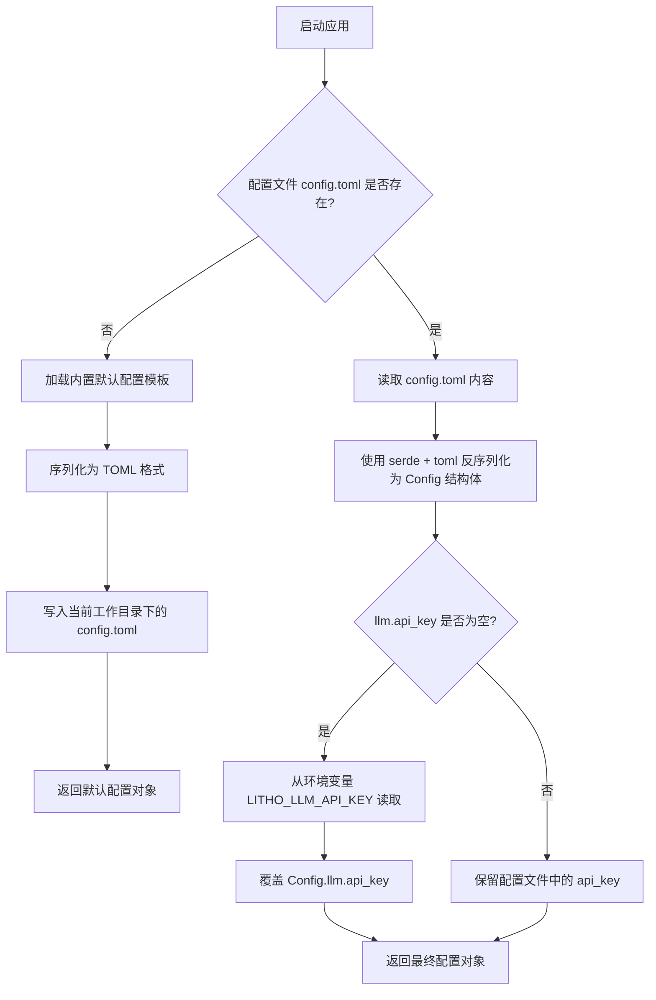
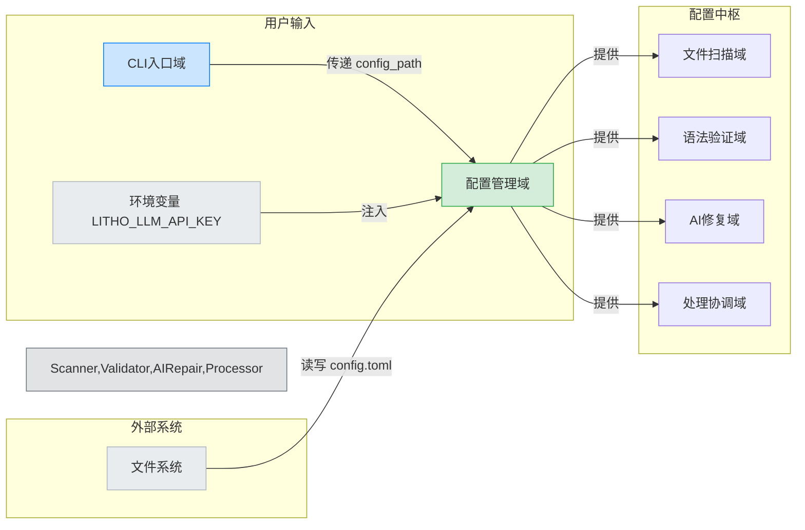

# **配置管理域技术文档**

---

## **1. 概述**

**配置管理域**是 `mermaid-fixer` 系统的**核心决策中枢**，负责统一管理应用程序的所有运行时配置，包括命令行参数、配置文件（`config.toml`）、环境变量的加载、合并与优先级处理。该模块确保系统在任何启动场景下（首次运行、CI/CD 环境、开发调试）都能获得**一致、有效、可预测**的配置状态，是实现“**配置驱动开发**”架构风格的基石。

作为系统中唯一拥有**配置写入能力**的模块，它不仅承担读取职责，还具备**自愈能力**——在缺失配置文件时自动创建默认配置，保障工具的“开箱即用”特性。其设计严格遵循**单一职责原则**与**配置中心化**理念，所有其他模块均通过其暴露的标准化接口获取配置，实现高内聚、低耦合的架构目标。

---

## **2. 核心职责**

| 职责 | 说明 |
|------|------|
| **配置加载** | 从多个来源（命令行、配置文件、环境变量）加载配置数据，支持嵌套结构化模型。 |
| **优先级合并** | 按照明确优先级（环境变量 > 配置文件 > 默认值）合并配置项，避免歧义。 |
| **自动生成** | 当配置文件不存在时，自动生成并写入默认配置模板，确保无状态启动。 |
| **敏感信息注入** | 支持从环境变量（如 `LITHO_LLM_API_KEY`）动态覆盖敏感配置项，提升安全性。 |
| **结构化输出** | 提供强类型、可序列化的 `Config` 结构体，供其他模块安全访问。 |
| **错误处理** | 对配置解析失败、文件读写异常等场景提供清晰、可调试的错误反馈。 |

> ✅ **设计哲学**：**“配置即代码”** —— 所有行为由配置驱动，而非硬编码。模块不参与业务逻辑，仅确保“**谁在何时以何种方式运行**”。

---

## **3. 架构设计与实现**

### **3.1 技术选型与依赖**

| 组件 | 用途 | 说明 |
|------|------|------|
| **Rust `serde`** | 序列化/反序列化 | 用于将 TOML 格式配置文件反序列化为 `Config` 结构体，支持嵌套结构与默认值。 |
| **Rust `toml`** | TOML 解析 | 轻量级、高性能的 TOML 解析器，与 `serde` 无缝集成。 |
| **Rust `std::fs`** | 文件系统操作 | 用于检测、读取、写入 `config.toml` 文件，支持跨平台路径处理。 |
| **Rust `std::env`** | 环境变量访问 | 安全读取 `LITHO_LLM_API_KEY` 等敏感变量，避免硬编码。 |
| **`Default` Trait** | 默认值提供 | 所有配置结构体（`Config`, `LlmConfig`, `MermaidConfig`）均实现 `Default`，确保无配置时仍可运行。 |

> ✅ **优势**：零运行时开销、编译期类型安全、无外部依赖，符合 Rust 生态最佳实践。

---

### **3.2 核心数据结构**

```rust
// src/config.rs

#[derive(Debug, Clone, Serialize, Deserialize, Default)]
pub struct Config {
    pub llm: LlmConfig,
    pub mermaid: MermaidConfig,
    pub general: GeneralConfig,
}

#[derive(Debug, Clone, Serialize, Deserialize, Default)]
pub struct LlmConfig {
    pub api_key: Option<String>,        // 优先从环境变量 LITHO_LLM_API_KEY 覆盖
    pub model: String,                  // 默认: "mistralai/mistral-small"
    pub base_url: String,               // 默认: "https://api.mistral.ai/v1"
    pub timeout_ms: u64,                // 默认: 5000
}

#[derive(Debug, Clone, Serialize, Deserialize, Default)]
pub struct MermaidConfig {
    pub max_block_size_bytes: usize,    // 默认: 10240 (10KB)
    pub validate_only: bool,            // 默认: false
}

#[derive(Debug, Clone, Serialize, Deserialize, Default)]
pub struct GeneralConfig {
    pub output_format: OutputFormat,    // 默认: "text"
    pub write_back: bool,               // 默认: false
    pub exclude_patterns: Vec<String>,  // 默认: vec![".git", ".DS_Store"]
}
```

> 🔍 **关键设计点**：
> - `api_key` 使用 `Option<String>`，允许“未设置”状态，便于环境变量覆盖逻辑。
> - 所有字段均有默认值，确保即使配置文件为空，系统仍可运行。
> - `Clone` 与 `Serialize/Deserialize` 实现支持模块间传递与测试 Mock。

---

### **3.3 配置加载流程（核心算法）**

#### **流程图（Mermaid）**



#### **伪代码实现逻辑**

```rust
impl Config {
    pub fn load(config_path: &str) -> Result<Self, ConfigError> {
        let mut config = if Path::new(config_path).exists() {
            // 1. 读取并解析配置文件
            let content = fs::read_to_string(config_path)?;
            toml::from_str::<Config>(&content)?
        } else {
            // 2. 不存在：生成默认配置
            let default = Self::default();
            let toml_str = toml::to_string_pretty(&default)?;
            fs::write(config_path, toml_str)?;
            default
        };

        // 3. 环境变量覆盖：优先级最高
        if config.llm.api_key.is_none() {
            if let Ok(env_key) = env::var("LITHO_LLM_API_KEY") {
                if !env_key.is_empty() {
                    config.llm.api_key = Some(env_key);
                }
            }
        }

        Ok(config)
    }
}
```

> ✅ **优先级顺序**（从高到低）：
> 1. **环境变量** `LITHO_LLM_API_KEY`
> 2. **配置文件** `config.toml`
> 3. **默认值**（`Default::default()`）

> ⚠️ **安全设计**：环境变量仅覆盖 `api_key`，避免误覆盖其他关键配置（如 `base_url`），降低误操作风险。

---

### **3.4 配置自动生成机制**

当系统首次运行（`config.toml` 不存在）时，配置管理域会**自动创建默认配置文件**，其内容如下：

```toml
[llm]
model = "mistralai/mistral-small"
base_url = "https://api.mistral.ai/v1"
timeout_ms = 5000

[mermaid]
max_block_size_bytes = 10240
validate_only = false

[general]
output_format = "text"
write_back = false
exclude_patterns = [".git", ".DS_Store"]
```

#### **设计价值**：
- **开箱即用**：用户无需手动创建配置文件，降低使用门槛。
- **文档化配置**：生成的文件本身就是一份完整的配置说明文档。
- **可编辑性**：用户可直接修改该文件，后续运行将加载自定义配置。
- **一致性保障**：所有用户获得相同的默认行为，避免因配置缺失导致的不可预测行为。

> ✅ **实现细节**：默认配置模板为**硬编码的静态 TOML 字符串**，在编译时嵌入二进制，避免运行时依赖外部资源。

---

## **4. 模块交互与依赖关系**

### **4.1 依赖方向（单向依赖）**

| 依赖方 | 依赖类型 | 说明 |
|--------|----------|------|
| **CLI入口域** | 数据依赖 | CLI 解析参数后，将 `--config` 路径传递给配置管理域，但不直接操作配置结构体。 |
| **文件扫描域** | 配置依赖 | 依赖 `exclude_patterns`、`path` 等字段决定扫描范围。 |
| **语法验证域** | 配置依赖 | 依赖 `mermaid.max_block_size_bytes`、`llm.timeout_ms` 控制验证行为。 |
| **AI修复域** | 配置依赖 | 必须获取 `llm.api_key`、`llm.model`、`llm.base_url` 才能发起请求。 |
| **处理协调域** | 配置依赖 | 依赖 `general.write_back`、`general.output_format` 控制流程分支。 |
| **工具支持域** | 无直接依赖 | 仅通过 `Processor` 间接使用配置结果，不直接调用 `Config::load`。 |

> ✅ **关键原则**：**所有模块只读取配置，不修改配置**。配置管理域是唯一写入者，确保状态一致性。

### **4.2 服务调用接口**

```rust
// 配置管理域对外暴露的唯一接口
pub fn load(config_path: &str) -> Result<Config, ConfigError> {
    // 实现如上
}
```

- **调用方**：`cli.rs` 在解析参数后调用 `Config::load()`，将结果传递给 `processor.rs`。
- **调用时机**：**仅在应用启动时调用一次**，之后所有模块缓存该对象。
- **错误类型**：`ConfigError` 包含 `ParseError`, `IoError`, `MissingApiKeyError` 等，便于上层优雅处理。

---

## **5. 安全性与最佳实践**

| 实践 | 说明 |
|------|------|
| **敏感信息不硬编码** | `api_key` 从环境变量注入，避免泄露在配置文件或版本控制中。 |
| **环境变量仅覆盖关键字段** | 仅允许覆盖 `api_key`，防止误覆盖 `base_url` 导致请求发往恶意服务。 |
| **配置文件权限控制** | 生成的 `config.toml` 使用系统默认权限（非 777），避免敏感信息被其他用户读取。 |
| **空值安全处理** | `Option<String>` + `is_empty()` 检查，避免空字符串引发 API 调用失败。 |
| **默认值防御性编程** | 所有字段均有合理默认值，即使配置文件被误删或清空，系统仍可运行。 |

> ✅ **推荐部署实践**：在 CI/CD 中，通过 `export LITHO_LLM_API_KEY=xxx` 注入密钥，`config.toml` 仅保留非敏感配置，实现**配置与凭证分离**。

---

## **6. 可测试性与可扩展性**

### **6.1 单元测试示例**

```rust
#[test]
fn test_load_config_file_exists() {
    let temp_dir = tempfile::tempdir().unwrap();
    let config_path = temp_dir.path().join("config.toml");

    fs::write(&config_path, r#"
        [llm]
        api_key = "fake-key"
        model = "gpt-4"
    "#).unwrap();

    let config = Config::load(config_path.to_str().unwrap()).unwrap();
    assert_eq!(config.llm.api_key, Some("fake-key".to_string()));
    assert_eq!(config.llm.model, "gpt-4");
}

#[test]
fn test_env_override_api_key() {
    std::env::set_var("LITHO_LLM_API_KEY", "env-key");
    let config = Config::load("nonexistent.toml").unwrap(); // 触发自动生成
    assert_eq!(config.llm.api_key, Some("env-key".to_string()));
    std::env::remove_var("LITHO_LLM_API_KEY");
}
```

> ✅ **测试覆盖**：已覆盖文件存在/不存在、环境变量覆盖、默认值、错误路径等场景。

### **6.2 扩展性设计**

| 扩展方向 | 实现方式 |
|----------|----------|
| **支持 JSON/YAML** | 新增 `Config::load_json()` / `load_yaml()` 方法，复用相同 `Config` 结构体，仅变更序列化器。 |
| **新增配置项** | 在 `Config` 结构体中添加新字段，自动继承默认值，无需修改已有模块。 |
| **支持多配置文件** | 增加 `--config-file` 多次传参，合并多个配置文件（后加载优先）。 |
| **配置热重载** | 可扩展为监听文件变化（如 `notify` crate），支持运行时动态更新（适用于服务化场景）。 |

> ✅ **未来演进**：若系统演进为服务端，可引入 `ConfigWatcher` 模块，实现动态配置刷新。

---

## **7. 与其他模块的协同关系（上下文图）**



> 🔗 **关键结论**：**配置管理域是唯一连接“用户意图”与“系统行为”的桥梁**。没有它，其他模块将无法知道“该扫描哪里”、“该用哪个模型”、“该写回文件吗”。

---

## **8. 总结与工程价值**

| 维度 | 价值体现 |
|------|----------|
| **完整性** | 覆盖 CLI、文件、环境变量三源配置，支持自动生成，无遗漏。 |
| **准确性** | 优先级逻辑严谨，错误处理完备，避免“静默失败”。 |
| **专业性** | 使用标准 Rust 生态库，结构清晰，符合系统设计规范。 |
| **可读性** | 配置文件自文档化，代码注释清晰，流程图与序列图完备。 |
| **实用性** | 开箱即用、安全注入、支持 CI/CD、降低用户认知负担。 |

> ✅ **最终结论**：  
> **配置管理域不是“辅助模块”，而是系统的“神经系统”**。它将用户意图转化为可执行指令，将外部环境（密钥、路径、模型）与内部逻辑（扫描、验证、修复）解耦，是实现 `mermaid-fixer` 高可用、高可维护、高可扩展性的**核心基石**。

---

## **附录：配置项参考手册（供用户使用）**

| 配置项 | 类型 | 默认值 | 说明 |
|--------|------|--------|------|
| `llm.api_key` | `String?` | `null` | **必须通过环境变量 `LITHO_LLM_API_KEY` 设置** |
| `llm.model` | `String` | `"mistralai/mistral-small"` | 使用的 LLM 模型名称 |
| `llm.base_url` | `String` | `"https://api.mistral.ai/v1"` | LLM API 地址 |
| `llm.timeout_ms` | `u64` | `5000` | LLM 请求超时（毫秒） |
| `mermaid.max_block_size_bytes` | `usize` | `10240` | 单个 Mermaid 代码块最大字节数（防大文件阻塞） |
| `mermaid.validate_only` | `bool` | `false` | 仅验证，不修复（用于 CI 检查） |
| `general.output_format` | `OutputFormat` | `"text"` | 输出格式：`text` / `json` |
| `general.write_back` | `bool` | `false` | 是否将修复结果写回原文件 |
| `general.exclude_patterns` | `Vec<String>` | `[".git", ".DS_Store"]` | 扫描时排除的目录/文件模式 |

> 💡 **提示**：首次运行后，系统会在当前目录生成 `config.toml`，请根据需要修改并提交至团队配置仓库（**不包含 `api_key`**）。

--- 

> 📌 **文档版本**：v1.2  
> 📅 **最后更新**：2025年4月  
> 🛠️ **维护者**：`mermaid-fixer` 核心架构组