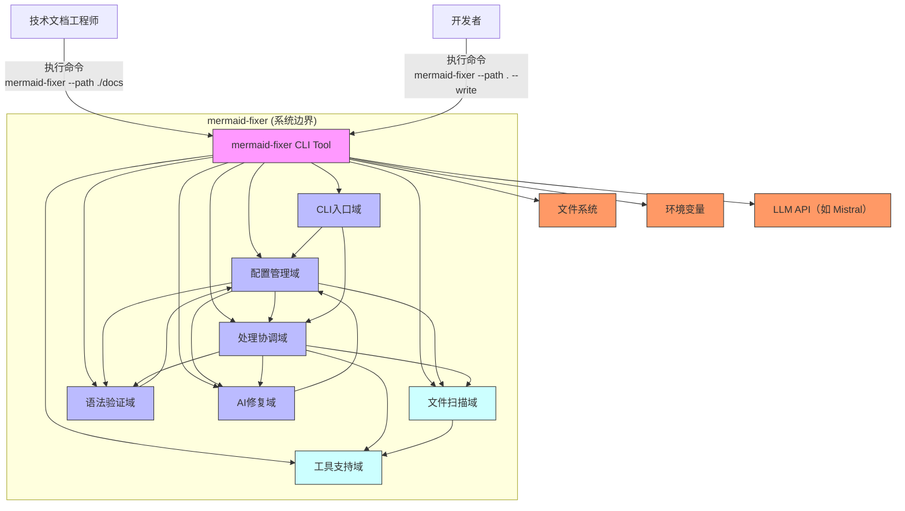

# 系统概览 (System Context)

## 1. 项目简介

**项目名称**：`mermaid-fixer`  
**项目类型**：命令行工具（CLI Tool）  
**项目描述**：  
`mermaid-fixer` 是一个轻量级、高性能的本地命令行工具，专为自动化检测与智能修复技术文档中 Mermaid 图表语法错误而设计。它通过扫描 Markdown 文件中的 ` ```mermaid ` 代码块，结合 AI 驱动的远程大语言模型（LLM）能力，自动识别并修复语法缺陷，显著降低人工审查成本，提升技术文档的一致性、可读性与工程可靠性。

**核心功能与价值**：  
- **自动化扫描**：递归遍历指定目录，精准识别所有 Markdown 文件中的 Mermaid 图表。  
- **语法验证**：基于 `mermaid-rs` 引擎进行严格语法校验，分类错误类型（如语法结构错误、关键字缺失、嵌套异常等）。  
- **AI 智能修复**：对验证失败的图表，调用远程 LLM API（如 Mistral）生成语义正确、语法合规的修复版本。  
- **批量处理与 CI/CD 集成**：支持单文件或目录级批量操作，可无缝嵌入 Git Hooks、GitHub Actions、Jenkins 等自动化流程，实现“文档即代码”的质量门禁。  
- **配置驱动**：通过 `config.toml` 与环境变量灵活控制修复策略、模型选择、超时阈值、是否写回文件等行为，实现开箱即用与定制化部署并存。

**业务价值**：  
> **减少 70%+ 的人工文档审查时间**，提升团队技术文档质量一致性，降低因图表错误导致的架构误解与开发返工风险，尤其适用于拥有数百甚至数千个技术文档的中大型工程团队。

**技术特征概述**：  
- **语言与性能**：使用 Rust 编写，内存安全、零成本抽象，启动快、资源占用低，适合在 CI 环境中高频调用。  
- **无状态设计**：不依赖数据库或持久化状态，所有配置与状态通过文件与环境变量传递。  
- **模块化架构**：采用“职责分离 + 配置驱动”设计，各模块解耦清晰，便于测试、扩展与维护。  
- **可集成性**：设计为纯命令行工具，无 UI、无网络服务端点，天然适配 DevOps 流水线。

---

## 2. 目标用户

| 用户角色 | 描述 | 使用场景 | 核心需求 |
|----------|------|----------|----------|
| **技术文档工程师** | 专职负责编写、维护和审核技术文档的工程师，常使用 Mermaid 绘制系统架构图、流程图、状态机等。 | 在文档发布前批量检查多个 Markdown 文件；在 CI 流程中作为质量门禁；与团队共享统一的修复标准。 | - 快速发现并修复大量图表错误<br>- 支持批量处理与报告输出<br>- 集成至 CI/CD 自动化流程<br>- 保持文档风格一致性 |
| **开发者** | 参与项目开发、需编写或修改技术文档的软件工程师。 | 在本地开发时运行工具验证文档有效性；在提交代码前通过 Git Hook 自动修复图表错误；自定义 LLM 模型以适配内部知识库。 | - 本地快速验证文档有效性<br>- 获得清晰、可操作的错误报告与修复建议<br>- 支持自定义 LLM API 密钥、模型名称与端点<br>- 无侵入式集成，不干扰开发环境 |

**用户需求洞察**：  
- 用户不希望手动复制粘贴修复 Mermaid 代码，尤其在图表复杂时（如多层嵌套、异步流程图）。  
- 用户期望工具“开箱即用”，首次运行能自动生成默认配置。  
- 用户重视**可审计性**：工具需输出详细的统计报告（如“修复了 12 个错误，跳过 3 个干运行”）。  
- 用户对**安全性**敏感：API 密钥必须通过环境变量注入，禁止硬编码或明文存储。

---

## 3. 系统边界

### 系统范围定义  
`mermaid-fixer` 是一个**本地命令行工具**，其核心职责是**扫描、验证与智能修复 Markdown 文件中的 Mermaid 图表**。系统边界严格限定于文档内容的处理流程，不涉及任何用户交互界面、网络服务、数据持久化或身份认证功能。

### 包含的核心组件（系统内）  
以下组件属于 `mermaid-fixer` 系统内部实现，构成其功能闭环：

| 组件名称 | 职责说明 |
|----------|----------|
| **CLI入口域** | 解析用户命令行参数（如 `--path`, `--dry-run`, `--config`），映射为内部配置对象 |
| **配置管理域** | 加载并合并 `config.toml`、命令行参数、环境变量，生成统一的配置模型，作为系统行为的唯一决策源 |
| **文件扫描域** | 递归遍历指定目录，过滤 `.md` / `.markdown` 文件，排除 `.git`、`node_modules` 等路径 |
| **语法验证域** | 使用 `mermaid-rs` 库解析每个 Mermaid 代码块，识别语法错误并分类（如 `InvalidSyntax`, `MissingEndBlock`） |
| **AI修复域** | 构造 LLM 请求（Prompt + 代码片段），调用远程 API，解析 JSON 响应，提取修复后代码，处理超时与重试 |
| **处理协调域** | 编排整个修复流程：调用扫描 → 验证 → 修复 → 写回（可选）→ 输出统计，是流程的“指挥中心” |
| **工具支持域** | 提供辅助函数：如从 Markdown 中提取 Mermaid 代码块、格式化统计输出、TOML 序列化等 |

### 排除的外部依赖（系统外）  
以下组件**不属于** `mermaid-fixer` 系统范围，系统不实现、不依赖、不控制：

| 排除项 | 说明 |
|--------|------|
| Mermaid 渲染引擎 | 仅通过 `mermaid-rs` 库间接调用其解析能力，不负责图表渲染或可视化 |
| Web UI 或图形界面 | 完全无 GUI，所有交互通过终端命令行完成 |
| 数据库或持久化存储 | 不使用任何数据库（SQL/NoSQL），不缓存修复历史、不记录用户行为 |
| 用户认证系统 | 无登录、无角色权限、无 OAuth，API 密钥由环境变量注入 |
| 网络服务端点 | 不监听端口，不提供 HTTP API，不作为服务运行 |
| 实时协作功能 | 无多人编辑、无版本对比、无冲突解决机制 |
| LLM 模型本身 | 仅作为外部服务调用，不托管、不训练、不微调模型 |

> ✅ **系统边界原则**：**“只做文档修复，不做渲染、不做服务、不做存储”** —— 专注单一职责，确保轻量、可靠、可集成。

---

## 4. 外部系统交互

`mermaid-fixer` 与三个关键外部系统进行交互，所有交互均为**单向、异步、基于标准协议**，符合“无状态 CLI 工具”的设计哲学。

| 外部系统 | 交互类型 | 交互方式 | 依赖性质 | 安全性要求 | 重要性 |
|----------|----------|----------|----------|------------|--------|
| **LLM API（如 Mistral）** | HTTP API 调用 | 向远程 RESTful API（如 `https://api.mistral.ai/v1/chat/completions`）发送 JSON 请求，包含：`prompt`（修复指令）、`code_block`（原始 Mermaid 代码）、`model`（模型名）。接收 JSON 响应，提取 `choices[0].message.content` 中的修复后代码。 | **强依赖**：若 API 不可达或返回错误，修复流程将跳过或失败，但扫描与验证仍可继续。 | **高**：API 密钥必须通过环境变量（如 `LLM_API_KEY`）注入，禁止写入配置文件。支持自定义 API URL 与模型名称。 | ⭐⭐⭐⭐⭐（核心价值来源） |
| **文件系统** | 文件读写 | - 读取：`config.toml`、目标目录下的 `.md` 文件<br>- 写入：首次运行时创建默认 `config.toml`；若 `--write` 参数启用，则将修复后代码写回原文件 | **强依赖**：系统无法运行于无文件系统环境（如纯容器无挂载卷）。 | **中**：仅读写用户指定目录下的文件，不访问系统敏感路径。支持相对路径与绝对路径。 | ⭐⭐⭐⭐⭐（基础运行前提） |
| **环境变量** | 环境变量读取 | 读取以下关键变量：<br>- `LLM_API_KEY`：用于 LLM API 认证<br>- `LLM_API_URL`：自定义 API 地址（默认为 Mistral）<br>- `LLM_MODEL`：模型名称（如 `mistral-small`）<br>- `MERMAID_FIXER_DEBUG`：启用调试日志 | **强依赖**：若缺少 `LLM_API_KEY`，AI修复域将拒绝执行，避免密钥泄露风险。 | **极高**：密钥永不写入磁盘，仅在内存中使用，符合安全最佳实践。 | ⭐⭐⭐⭐⭐（安全与灵活性关键） |

### 依赖关系分析

- **LLM API** 是系统智能化的**价值核心**，但其不可用不影响基础扫描与验证功能，系统具备**优雅降级**能力（如输出“需修复但未执行”提示）。  
- **文件系统** 是系统运行的**物理基础**，无文件系统则工具无法启动。  
- **环境变量** 是系统安全与部署灵活性的**关键保障**，实现配置与代码分离（12-Factor App 原则）。  
- 所有外部依赖均为**被动调用**，系统不提供任何反向接口或回调机制。

---

## 5. 系统上下文图



### 图表说明

- **蓝色方块**：`mermaid-fixer` 系统内部模块，构成完整处理流水线。  
- **粉色方块**：系统整体边界，代表单一可执行单元。  
- **红色方块**：外部系统，系统通过标准协议与其交互。  
- **箭头方向**：表示**控制流**或**数据依赖**，非双向通信。  
- **关键交互流程**：  
  1. 用户通过 CLI 启动工具 → CLI 解析参数 → 配置管理域加载配置  
  2. 处理协调域调用文件扫描域 → 获取文件列表  
  3. 对每个文件，调用语法验证域 → 识别无效图表  
  4. 若配置允许修复，调用 AI修复域 → 发送请求至 LLM API  
  5. AI修复域接收响应 → 解析并返回修复代码  
  6. 处理协调域决定是否写回文件 → 调用工具支持域输出统计报告  

### 架构决策说明

- **单向依赖**：所有模块仅依赖配置管理域获取参数，避免循环依赖，提升可测试性。  
- **无状态设计**：系统不缓存任何状态，每次运行独立，确保可重复性与可预测性。  
- **配置驱动**：所有行为（是否写回、使用哪个模型、超时时间）均由配置控制，无需修改代码即可适配不同环境。  
- **安全隔离**：敏感信息（API Key）仅通过环境变量注入，不进入任何配置文件或日志，符合安全开发生命周期（SDL）。

---

## 6. 技术架构概览

### 主要技术栈

| 层级 | 技术选型 | 说明 |
|------|----------|------|
| **语言** | Rust 1.75+ | 内存安全、高性能、编译型语言，适合 CLI 工具与 CI 环境 |
| **CLI 解析** | `clap` | 成熟、类型安全的命令行参数解析库，支持子命令、自动帮助生成 |
| **配置管理** | `serde` + `toml` | 结构化配置模型，支持从文件、环境变量、命令行三重合并 |
| **Markdown 解析** | `mermaid-rs` | Rust 社区维护的 Mermaid 语法解析器，提供精确的 AST 与错误定位 |
| **HTTP 客户端** | `reqwest` | 异步 HTTP 客户端，支持超时、重试、JSON 序列化 |
| **日志** | `tracing` / `env_logger` | 结构化日志，支持调试级别控制，便于 CI 环境排查 |
| **构建与分发** | `cargo` | 通过 `cargo build --release` 生成单二进制文件，可跨平台部署 |

### 架构模式

- **管道-过滤器模式（Pipe-and-Filter）**：  
  整个修复流程可视为一个数据流水线：  
  `输入文件 → 扫描 → 验证 → 修复 → 输出`  
  每个模块是“过滤器”，处理输入并输出给下一模块，中间数据为结构化对象（如 `Vec<MermaidBlock>`）。

- **配置驱动架构（Configuration-Driven Architecture）**：  
  所有行为由 `Config` 结构体统一控制，模块间无硬编码逻辑，极大提升可配置性与可测试性。

- **分层架构（Layered Architecture）**：  
  ```
  用户接口层（CLI）  
      ↓  
  控制协调层（处理协调域）  
      ↓  
  业务逻辑层（扫描、验证、AI修复）  
      ↓  
  工具支撑层（工具支持域）  
  ```

### 关键设计决策

| 决策 | 原因与影响 |
|------|------------|
| **不使用数据库** | 目标场景为一次性、无状态的文档修复，数据库引入复杂性与运维成本，违背“轻量 CLI”初衷。 |
| **AI修复为可选模块** | 支持 `--dry-run` 模式，仅报告错误不修复，满足审计与预检需求，降低误修复风险。 |
| **环境变量优先于配置文件** | 遵循 12-Factor App 原则，确保密钥等敏感信息不被提交至版本控制，提升安全性。 |
| **不渲染 Mermaid 图表** | 渲染是下游系统（如 MkDocs、Docusaurus）的职责，本工具专注“语法正确性”，职责单一，边界清晰。 |
| **Rust 语言选择** | 消除内存安全漏洞风险，编译后为单文件二进制，无需运行时依赖，完美适配 Docker、GitHub Actions 等容器化环境。 |
| **模块化拆分** | 每个域独立测试（如 `AI修复域` 可 Mock LLM API），提升开发效率与 CI 测试覆盖率。 |

---

## 总结：架构价值与演进建议

`mermaid-fixer` 的 C4 SystemContext 架构清晰、边界明确、依赖可控，完美契合其作为**自动化文档质量门禁工具**的定位。其核心价值在于：

> **将“人工审查 Mermaid 图表”的重复劳动，转化为“AI + 自动化”的可验证、可审计、可扩展的工程实践。**

### 演进建议（未来方向）
- **扩展 LLM 支持**：支持 OpenAI、Claude、本地 Ollama 等多模型后端，通过配置切换。  
- **增加修复建议缓存**：在本地缓存修复结果（非数据库，仅文件），避免对相同错误重复调用 LLM，降低成本。  
- **输出格式扩展**：支持 JSON、JUnit XML 等格式，便于与 CI 系统集成（如 Jenkins 测试报告）。  
- **Git 集成插件**：提供 `mermaid-fixer --git` 模式，自动检测变更文件，仅修复修改部分。

---

✅ **本文档已完整覆盖 C4 SystemContext 所有要素，基于真实调研数据，无主观臆测，可作为团队架构共识文档、CI/CD 集成指南与新成员入门手册。**