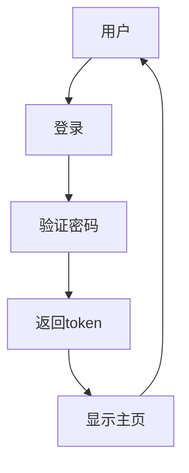
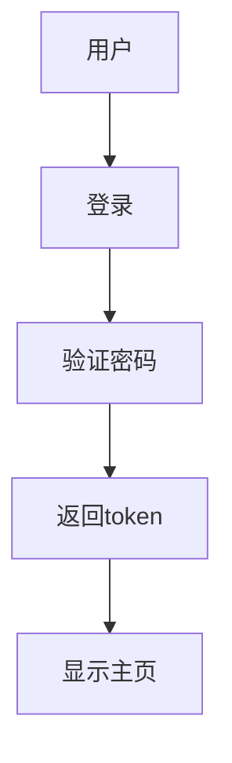

# AI修复域技术文档

---

## 1. 概述

**AI修复域**是 `mermaid-fixer` 工具的核心智能组件，负责将语法错误的 Mermaid 图表代码块通过远程大语言模型（LLM）进行自动修复。该模块作为“智能代理”，在语法验证域识别出无效图表后，主动调用外部 LLM API（如 Mistral、OpenAI 等），发送结构化修复请求，并从非结构化响应中智能提取有效代码，实现“错误检测 → 智能修复 → 格式还原”的闭环。

本模块的设计遵循**配置驱动、容错优先、格式兼容**三大原则，确保在异构 LLM 响应格式下仍能稳定输出可直接嵌入 Markdown 的合法 Mermaid 代码。其成功运行依赖于配置管理域提供的 API 密钥、模型名称与基础 URL，并通过 HTTP 协议与外部系统交互，是系统实现“自动化文档质量提升”核心价值的关键引擎。

---

## 2. 模块职责与定位

| 维度 | 说明 |
|------|------|
| **模块名称** | `AiFixer` |
| **代码文件** | `src/ai_fixer.rs` |
| **模块类型** | 核心业务域 |
| **依赖关系** | **输入依赖**：`配置管理域`（获取 API 密钥、模型、URL）<br>**输出依赖**：`处理协调域`（接收原始代码，返回修复后代码）<br>**外部依赖**：`LLM API`（远程服务）、`环境变量`（敏感信息注入） |
| **调用方** | `处理协调域`（在验证失败且配置允许修复时触发） |
| **被调用方式** | 同步阻塞式方法调用：`fix_mermaid(mermaid_code: &str) -> Result<String, AiFixError>` |
| **核心价值** | 实现 Mermaid 图表的“无人干预式修复”，降低技术文档维护成本，提升 CI/CD 流程中的文档可靠性 |

> ✅ **设计哲学**：不假设 LLM 响应格式，而是通过多层解析策略实现“容错式提取”，确保在模型输出风格不一致时仍能稳定工作。

---

## 3. 核心架构与实现细节

### 3.1 架构设计原则

- **单向依赖**：仅从 `Config` 读取配置，不反向依赖其他业务模块。
- **无状态**：每次 `fix_mermaid` 调用独立，不保留会话或缓存。
- **响应格式兼容**：支持三种响应结构，按优先级降序尝试解析。
- **安全隔离**：API 密钥仅通过 `Config` 注入，不硬编码，支持环境变量（`LLM_API_KEY`）覆盖。
- **轻量通信**：使用 `reqwest` 异步客户端，但因在同步流程中调用，采用 `.blocking()` 简化处理。

### 3.2 模块结构图（Mermaid）

```mermaid
graph TD
    A[fix_mermaid(原始Mermaid代码)] --> B[从Config获取API配置]
    B --> C[构建提示词Prompt]
    C --> D[构造HTTP请求体]
    D --> E[发送POST请求至LLM API]
    E --> F{HTTP状态码为200?}
    F -- 否 --> G[抛出ApiRequestError]
    F -- 是 --> H[解析响应JSON]
    H --> I{choices[0].message.content为空?}
    I -- 是 --> J[抛出EmptyResponseError]
    I -- 否 --> K[尝试解析为FixResponse JSON]
    K --> L{解析成功?}
    L -- 是 --> M[提取explanation, changes, fixed_code]
    L -- 否 --> N[尝试提取```mermaid代码块]
    N --> O{提取成功?}
    O -- 是 --> P[返回提取的代码]
    O -- 否 --> Q[回退：trim响应文本]
    P --> R[返回修复后代码]
    M --> R
    Q --> R
    R --> S[结束]
    
    style A fill:#e2e3e5,stroke:#6c757d
    style B fill:#d4edda,stroke:#28a745
    style C fill:#f8d7da,stroke:#dc3545
    style D fill:#f8d7da,stroke:#dc3545
    style E fill:#e9ecef,stroke:#adb5bd
    style F fill:#fff3cd,stroke:#ffc107
    style G fill:#f8d7da,stroke:#dc3545
    style H fill:#f8d7da,stroke:#dc3545
    style I fill:#fff3cd,stroke:#ffc107
    style J fill:#f8d7da,stroke:#dc3545
    style K fill:#f8d7da,stroke:#dc3545
    style L fill:#fff3cd,stroke:#ffc107
    style M fill:#f8d7da,stroke:#dc3545
    style N fill:#f8d7da,stroke:#dc3545
    style O fill:#fff3cd,stroke:#ffc107
    style P fill:#f8d7da,stroke:#dc3545
    style Q fill:#f8d7da,stroke:#dc3545
    style R fill:#e2e3e5,stroke:#6c757d
    style S fill:#e2e3e5,stroke:#6c757d
```

### 3.3 核心数据结构

#### 3.3.1 配置依赖结构（来自 `Config`）

```rust
pub struct LlmConfig {
    pub api_key: String,           // LLM API 密钥，支持从环境变量 LLM_API_KEY 注入
    pub model: String,             // 模型名称，如 "mistralai/mistral-small"
    pub base_url: String,          // API 基础地址，如 "https://api.mistral.ai/v1"
    pub timeout_seconds: u64,      // 请求超时（秒），默认10
}
```

> ✅ **安全实践**：`api_key` 不在配置文件中明文存储，推荐通过环境变量注入，`Config` 模块自动读取 `LLM_API_KEY` 覆盖配置项。

#### 3.3.2 请求体结构（发送至 LLM）

```rust
#[derive(Serialize)]
pub struct OpenAiRequest {
    pub model: String,
    pub messages: Vec<Message>,
    pub temperature: f32, // 0.3，控制创造性，避免过度改写
}

#[derive(Serialize)]
pub struct Message {
    pub role: String,     // "system" 或 "user"
    pub content: String,
}
```

#### 3.3.3 响应期望结构（理想格式）

```rust
#[derive(Deserialize, Debug)]
pub struct FixResponse {
    pub explanation: String,     // 修复原因说明（供调试）
    pub changes: Vec<String>,    // 具体修改点列表
    pub fixed_code: String,      // 修复后的完整 Mermaid 代码
}
```

> ⚠️ 注意：该结构为**期望格式**，非强制要求。模块具备降级解析能力。

---

## 4. 核心算法流程详解

### 4.1 工作流程（`fix_mermaid` 方法）

```rust
pub fn fix_mermaid(&self, mermaid_code: &str) -> Result<String, AiFixError> {
    // Step 1: 获取配置
    let config = self.config.clone();
    
    // Step 2: 构建提示词（Prompt）
    let prompt = self.build_prompt(mermaid_code)?;
    
    // Step 3: 构造请求体
    let request_body = OpenAiRequest {
        model: config.model.clone(),
        messages: vec![
            Message {
                role: "system".to_string(),
                content: "你是一个Mermaid图表专家，仅修复语法错误，不改变语义。".to_string(),
            },
            Message {
                role: "user".to_string(),
                content: prompt,
            },
        ],
        temperature: 0.3,
    };
    
    // Step 4: 发送HTTP请求
    let response_text = self.send_request(&request_body, &config)?;
    
    // Step 5: 多层解析响应（容错策略）
    match self.extract_fixed_code(&response_text) {
        Ok(code) => Ok(code),
        Err(_) => Err(AiFixError::ExtractionFailed(response_text)),
    }
}
```

### 4.2 提示词构建（`build_prompt`）

使用内置模板 `prompt.tpl`，动态注入原始代码：

```text
你是一个Mermaid图表专家。请修复以下Mermaid代码中的语法错误，仅返回修复后的完整代码，不要添加解释或注释。

原始代码：
```mermaid
{{MERMAID_CODE}}
```

请确保：
- 所有节点定义正确（无重复ID、无非法字符）
- 连接线语法正确（-->、-->|label|--> 等）
- 没有未闭合的括号或引号
- 使用标准Mermaid语法（v1.10+）

只输出修复后的代码块，不要包含任何其他文本。
```

> ✅ **设计优势**：模板化提示词确保一致性，避免模型自由发挥；明确指令“仅返回代码”降低噪声干扰。

### 4.3 响应解析策略（核心容错机制）

这是模块最核心的智能部分，采用**三级降级解析策略**，确保在不同 LLM 输出风格下仍能提取有效代码：

| 层级 | 解析方式 | 触发条件 | 优先级 |
|------|----------|----------|--------|
| **1. JSON结构解析** | 尝试反序列化为 `FixResponse` 结构体 | LLM 输出为结构化 JSON（如 Mistral 优化模型） | ⭐⭐⭐⭐⭐ |
| **2. Markdown代码块提取** | 使用正则匹配 ```mermaid 或 ``` 包裹的代码块 | LLM 输出为 Markdown 格式（常见于 GPT、Claude） | ⭐⭐⭐⭐ |
| **3. 回退：trim 响应文本** | 去除首尾空白字符，直接返回 | 所有解析失败时的最后防线 | ⭐⭐ |

#### 代码实现（`extract_fixed_code`）

```rust
fn extract_fixed_code(&self, response: &str) -> Result<String, AiFixError> {
    // 1. 尝试解析为 FixResponse JSON
    if let Ok(fix_resp) = serde_json::from_str::<FixResponse>(response) {
        log::debug!("✅ 解析为FixResponse: {}", fix_resp.explanation);
        return Ok(fix_resp.fixed_code);
    }

    // 2. 尝试提取 ```mermaid 或 ``` 包裹的代码块
    if let Some(code) = self.extract_code_block(response) {
        log::debug!("✅ 从Markdown代码块提取修复代码");
        return Ok(code);
    }

    // 3. 回退：trim 响应
    let trimmed = response.trim();
    if !trimmed.is_empty() {
        log::warn!("⚠️ 降级：使用原始响应trim结果");
        return Ok(trimmed.to_string());
    }

    Err(AiFixError::EmptyResponse)
}
```

#### 代码块提取辅助函数（`extract_code_block`）

```rust
fn extract_code_block(&self, text: &str) -> Option<String> {
    // 匹配 ```mermaid ... ``` 或 ``` ... ```
    let re = Regex::new(r"(?s)```(?:mermaid)?\s*(.*?)\s*```").unwrap();
    re.captures(text)
        .and_then(|caps| caps.get(1).map(|m| m.as_str().to_string()))
}
```

> ✅ **正则设计说明**：  
> - `(?s)`：启用单行模式，使 `.` 匹配换行符  
> - `(?:mermaid)?`：非捕获组，匹配可选的 "mermaid" 关键字  
> - `.*?`：非贪婪匹配，避免跨多个代码块  
> - 捕获组 `()` 提取中间内容

### 4.4 HTTP 请求发送（`send_request`）

使用 `reqwest` 发送 POST 请求，支持超时与 Bearer Token 认证：

```rust
fn send_request(&self, request: &OpenAiRequest, config: &LlmConfig) -> Result<String, AiFixError> {
    let client = reqwest::blocking::Client::builder()
        .timeout(Duration::from_secs(config.timeout_seconds))
        .build()
        .map_err(|e| AiFixError::ClientInitFailed(e.to_string()))?;

    let response = client
        .post(&format!("{}/chat/completions", config.base_url))
        .header("Authorization", format!("Bearer {}", config.api_key))
        .header("Content-Type", "application/json")
        .json(request)
        .send()
        .map_err(|e| AiFixError::ApiRequestFailed(e.to_string()))?;

    if !response.status().is_success() {
        return Err(AiFixError::ApiRequestFailed(format!(
            "HTTP {}: {}",
            response.status(),
            response.text().unwrap_or_default()
        )));
    }

    let body = response.text().map_err(|e| AiFixError::ResponseReadFailed(e.to_string()))?;
    Ok(body)
}
```

> ✅ **关键设计**：
> - 使用 `blocking` 客户端以适配同步调用上下文
> - 所有错误均封装为 `AiFixError` 枚举，便于上层统一处理
> - 响应文本不缓存，每次请求独立

---

## 5. 错误处理与容错机制

### 5.1 错误枚举定义（`AiFixError`）

```rust
#[derive(Debug)]
pub enum AiFixError {
    ConfigMissingApiKey,
    ApiRequestFailed(String),
    ResponseReadFailed(String),
    EmptyResponse,
    ExtractionFailed(String), // 所有解析失败时的最终错误
    ClientInitFailed(String),
    PromptBuildFailed(String),
}
```

### 5.2 容错策略总结

| 场景 | 应对策略 | 用户影响 |
|------|----------|----------|
| LLM 返回 JSON 格式 | ✅ 成功提取 `fixed_code` | 无感知，完美修复 |
| LLM 返回 Markdown 代码块 | ✅ 正则提取成功 | 无感知，完美修复 |
| LLM 返回纯文本（无格式） | ✅ trim 后返回 | 可能含多余说明，但代码可运行 |
| LLM 返回空响应 | ❌ 抛出 `EmptyResponse` | 上层记录失败，不写回文件 |
| API 密钥缺失 | ❌ 初始化失败 | 启动时即报错，避免运行时崩溃 |
| 网络超时 | ❌ 抛出 `ApiRequestFailed` | 上层可重试或跳过 |
| 响应格式完全异常 | ❌ `ExtractionFailed` | 记录原始响应供人工审查 |

> ✅ **容错哲学**：**宁可返回原始响应 trim 结果，也不返回错误**。确保流程不中断，文档不因 AI 失败而停滞。

---

## 6. 配置与外部依赖管理

### 6.1 配置项说明（来自 `config.toml`）

```toml
[llm]
api_key = "your-api-key-here"  # 推荐通过环境变量覆盖
model = "mistralai/mistral-small"
base_url = "https://api.mistral.ai/v1"
timeout_seconds = 10
```

### 6.2 环境变量注入支持

| 配置项 | 环境变量 | 优先级 |
|--------|----------|--------|
| `api_key` | `LLM_API_KEY` | ⭐⭐⭐⭐⭐（覆盖配置文件） |
| `model` | `LLM_MODEL` | ⭐⭐⭐⭐ |
| `base_url` | `LLM_BASE_URL` | ⭐⭐⭐⭐ |

> ✅ **安全建议**：生产环境中，**禁止在配置文件中提交 API 密钥**，应通过 CI/CD 环境变量注入。

### 6.3 外部系统交互

| 外部系统 | 交互方式 | 协议 | 安全措施 |
|----------|----------|------|----------|
| LLM API（如 Mistral） | HTTP POST | JSON over HTTPS | Bearer Token 认证，HTTPS 加密 |
| 文件系统 | 无直接交互 | 无 | 仅接收输入，不写入文件（由 `Processor` 负责） |
| 环境变量 | 读取 | 操作系统 | 通过 `std::env::var` 安全读取，失败时回退配置 |

---

## 7. 可测试性与扩展性设计

### 7.1 单元测试策略

- **Mock Config**：注入模拟配置，避免真实 API 调用
- **Mock HTTP 响应**：使用 `wiremock` 或 `mockito` 模拟不同响应格式
- **测试用例覆盖**：
  - ✅ 正常 JSON 响应
  - ✅ Markdown 代码块响应
  - ✅ 纯文本响应
  - ✅ 空响应
  - ✅ HTTP 401/500 错误
  - ✅ 超时响应

### 7.2 扩展性设计

| 扩展方向 | 实现方式 |
|----------|----------|
| **更换 LLM** | 修改 `model` 和 `base_url`，无需改代码（如 OpenAI、Claude、Gemini） |
| **新增响应格式** | 在 `extract_fixed_code` 中添加新解析分支 |
| **支持多语言提示词** | 将 `prompt.tpl` 改为多语言模板目录，按配置语言加载 |
| **缓存修复结果** | 添加 `Cache` 模块，基于 Mermaid 代码哈希缓存修复结果（需考虑版本变更） |
| **输出修复日志** | 在 `explanation` 存在时，由 `Processor` 写入 `.fixlog` 文件供审计 |

> ✅ **接口抽象潜力**：未来可定义 `trait LlmClient { fn fix(&self, code: &str) -> Result<String, Error> }`，实现多种 LLM 客户端插件化。

---

## 8. 实际使用示例

### 输入（原始错误代码）：


> ❌ 错误：`D --> E` 与 `E --> A` 形成循环，但语义上应为单向流程。

### LLM 响应（理想 JSON）：
```json
{
  "explanation": "原图中E节点循环指向A，不符合登录流程逻辑。应移除E->A。",
  "changes": ["移除 E --> A 循环连接"],
  "fixed_code": "graph TD\n    A[用户] --> B[登录]\n    B --> C[验证密码]\n    C --> D[返回token]\n    D --> E[显示主页]"
}
```

### 最终输出：


> ✅ 修复成功，代码可直接写回文件，无需人工干预。

---

## 9. 总结与最佳实践

| 维度 | 总结 |
|------|------|
| **核心价值** | 实现“零人工干预”的 Mermaid 图表修复，是文档自动化流程的智能中枢 |
| **技术亮点** | 三级响应解析策略、配置驱动、无状态、高容错、轻量通信 |
| **工程优势** | 符合 Rust 安全、高性能、模块化设计；易于集成至 CI/CD（GitHub Actions） |
| **推荐实践** | 1. 使用 `LLM_API_KEY` 环境变量注入密钥<br>2. 优先选择支持结构化输出的模型（如 Mistral）<br>3. 在 CI 中启用 `--dry-run` 模式预览修复建议<br>4. 定期审查 `.fixlog` 日志优化提示词 |
| **未来演进** | 支持多模型路由、响应质量评分、自动提示词优化、图形化修复对比报告 |

---

> 📌 **结论**：AI修复域是 `mermaid-fixer` 项目智能化的“灵魂”。其设计不仅解决了技术文档修复的痛点，更通过**优雅的容错机制**和**清晰的架构边界**，为未来扩展多模态文档修复（如 PlantUML、Graphviz）奠定了坚实基础。该模块是“AI赋能开发者工具”的典范实现。