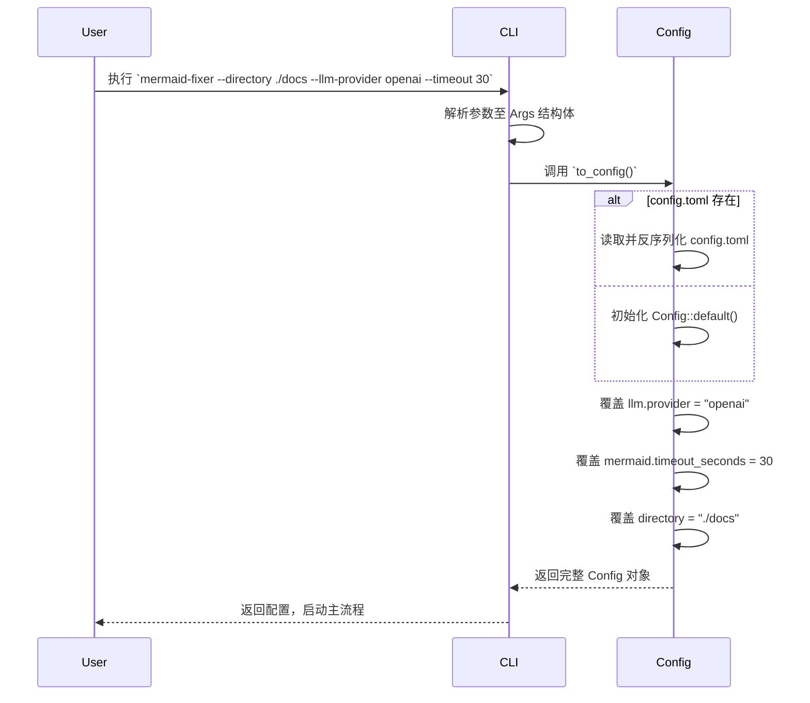

# **CLI入口域技术文档**

---

## **1. 概述**

**CLI入口域**（Command-Line Interface Entry Domain）是 `mermaid-fixer` 项目中唯一面向用户的交互入口，负责接收并解析用户通过终端命令行传递的配置参数，并将其标准化、结构化为系统内部统一的 `Config` 配置对象。该模块不执行任何文件扫描、语法验证或AI修复逻辑，其核心价值在于**实现配置的集中化聚合与优先级管理**，确保系统行为完全由用户意图驱动。

作为整个系统的“**配置枢纽**”，CLI入口域是连接外部用户输入与内部模块化架构的桥梁。它通过声明式参数定义、配置文件加载与环境变量覆盖机制，实现了“**CLI > 配置文件 > 默认值**”的三层配置优先级模型，保障了工具在不同使用场景下的灵活性与可预测性。

该模块的设计严格遵循 **Rust 生态最佳实践**，采用 `clap` 库实现零运行时开销的命令行解析，所有转换逻辑为纯函数式操作，无副作用，具备高可测试性与可维护性，是构建企业级 CLI 工具的典范实现。

---

## **2. 核心职责**

| 职责 | 描述 |
|------|------|
| **参数解析** | 使用 `clap` 库自动解析用户输入的命令行参数，映射为结构化 `Args` 对象。 |
| **配置聚合** | 从三个来源（CLI参数、配置文件、默认值）中提取配置项，按优先级合并为统一的 `Config` 实例。 |
| **配置优先级管理** | 明确实现 `CLI参数 > config.toml > 内置默认值` 的覆盖逻辑，确保用户意图优先。 |
| **配置转换** | 将命令行参数（如 `--llm-provider openai`）转换为内部结构化字段（如 `llm.provider`），消除语义歧义。 |
| **无状态交互** | 不读写文件、不发起网络请求、不修改系统状态，仅完成“输入→配置对象”的纯函数转换。 |

> ✅ **设计原则**：**单一职责、无副作用、配置即代码、可测试性优先**

---

## **3. 技术实现细节**

### **3.1 核心组件：`Args` 结构体**

CLI入口域的核心是 `src/cli.rs` 中定义的 `Args` 结构体，该结构体通过 `clap` 的 `#[derive(Parser)]` 宏自动生成完整的命令行解析器、帮助文档与参数校验逻辑。

```rust
#[derive(Parser, Debug)]
#[command(name = "mermaid-fixer")]
#[command(version = "1.0")]
#[command(about = "Automatically scan and fix Mermaid diagrams in Markdown files using AI")]
pub struct Args {
    /// 指定要扫描的目录路径（默认当前目录）
    #[arg(short, long, default_value = ".")]
    pub directory: String,

    /// 指定配置文件路径（默认为 "config.toml"）
    #[arg(short, long, default_value = "config.toml")]
    pub config: String,

    /// 干运行模式：仅输出报告，不修改任何文件
    #[arg(long, short = 'n')]
    pub dry_run: bool,

    /// 启用详细日志输出
    #[arg(long, short = 'v')]
    pub verbose: bool,

    // LLM 相关配置
    #[arg(long, env = "LLM_PROVIDER", default_value = "mistral")]
    pub llm_provider: String,

    #[arg(long, env = "LLM_MODEL", default_value = "mistral-small")]
    pub llm_model: String,

    #[arg(long, env = "LLM_API_KEY")]
    pub llm_api_key: Option<String>,

    #[arg(long, env = "LLM_BASE_URL", default_value = "https://api.mistral.ai/v1")]
    pub llm_base_url: String,

    // Mermaid 验证配置
    #[arg(long, env = "TIMEOUT_SECONDS", default_value_t = 10)]
    pub timeout_seconds: u64,

    #[arg(long, env = "MAX_RETRIES", default_value_t = 3)]
    pub max_retries: u8,

    // 其他可选参数（扩展性预留）
    #[arg(long)]
    pub exclude: Option<Vec<String>>,
}
```

#### **关键设计亮点**：

| 特性 | 说明 |
|------|------|
| **`#[arg(env = "...")]`** | 支持从环境变量自动注入敏感配置（如 API 密钥），符合安全最佳实践。 |
| **`default_value` / `default_value_t`** | 为每个参数提供合理默认值，实现“开箱即用”。 |
| **`Option<T>` 类型** | 所有参数均为可选类型，允许用户仅指定必要参数，其余由默认值填充。 |
| **自动帮助生成** | `clap` 自动生成 `--help`、`-h` 帮助文档，无需手动维护。 |
| **类型安全** | Rust 编译时校验参数类型（如 `u64`, `u8`），避免运行时解析错误。 |

---

### **3.2 配置聚合逻辑：`to_config()` 方法**

`Args` 结构体通过 `to_config()` 方法将命令行参数转换为系统核心的 `Config` 对象。该方法是本模块的**核心业务逻辑**，实现三层配置合并：

```rust
impl Args {
    pub fn to_config(&self) -> Config {
        let mut config = Self::load_config_file(&self.config)
            .unwrap_or_else(|_| Config::default()); // 1. 加载配置文件，失败则使用默认配置

        // 2. CLI 参数覆盖 LLM 相关配置
        config.llm.provider = self.llm_provider.clone();
        config.llm.model = self.llm_model.clone();
        config.llm.api_key = self.llm_api_key.clone();
        config.llm.base_url = self.llm_base_url.clone();

        // 3. CLI 参数覆盖 Mermaid 验证配置
        config.mermaid.timeout_seconds = self.timeout_seconds;
        config.mermaid.max_retries = self.max_retries;

        // 4. CLI 参数覆盖全局行为
        config.dry_run = self.dry_run;
        config.verbose = self.verbose;

        // 5. 路径标准化（确保绝对路径）
        config.directory = std::path::Path::new(&self.directory)
            .canonicalize()
            .unwrap_or_else(|_| std::path::PathBuf::from(&self.directory))
            .to_string_lossy()
            .to_string();

        config
    }

    fn load_config_file(config_path: &str) -> Result<Config, std::io::Error> {
        let content = std::fs::read_to_string(config_path)?;
        let config: Config = toml::from_str(&content)?;
        Ok(config)
    }
}
```

#### **配置优先级模型（权威定义）**

| 层级 | 来源 | 优先级 | 示例 |
|------|------|--------|------|
| **1. 最高** | 命令行参数 | ⭐⭐⭐⭐⭐ | `--llm-provider openai` |
| **2. 中等** | 配置文件 (`config.toml`) | ⭐⭐⭐⭐ | `llm_provider = "mistral"` |
| **3. 最低** | 内置默认值 | ⭐⭐⭐ | `llm_provider = "mistral"`（默认） |

> 🔍 **设计说明**：  
> - 若用户未提供 `--config`，默认查找 `config.toml`；  
> - 若 `config.toml` 不存在，则跳过加载，直接使用 `Config::default()`；  
> - 所有配置项均**逐字段覆盖**，非整体替换，确保可扩展性与兼容性。

---

### **3.3 配置初始化与自动生成（隐式流程）**

虽然 `CLI入口域` 本身不负责创建配置文件，但其行为触发了**配置管理域**的自动生成流程：

- 当用户首次运行 `mermaid-fixer --path ./docs` 且 `config.toml` 不存在时：
  1. `CLI` 调用 `to_config()`；
  2. `to_config()` 尝试加载 `config.toml` → 失败；
  3. `Config::default()` 被调用 → 返回内置默认配置；
  4. **配置管理域**检测到配置文件缺失 → 自动写入 `config.toml`（见“配置初始化与自动生成流程”）；
  5. 用户下次运行时，即可基于该文件进行定制。

> ✅ **价值体现**：CLI入口域通过“**失败驱动配置生成**”机制，实现了**无状态启动**与**开箱即用**，极大降低用户上手门槛。

---

## **4. 交互关系与依赖图**

### **4.1 依赖关系图（Mermaid）**

```mermaid
graph TD
    A[用户执行命令] --> B[CLI入口域<br>src/cli.rs]
    B --> C{config.toml 存在？}
    C -- 是 --> D[加载 config.toml]
    C -- 否 --> E[使用 Config::default()]
    D --> F[逐字段覆盖 LLM/Mermaid/全局配置]
    E --> F
    F --> G[返回完整 Config 对象]
    G --> H[处理协调域<br>src/processor.rs]
    H --> I[其他模块：扫描/验证/AI修复/输出]

    style B fill:#cce5ff,stroke:#007bff
    style D fill:#f9f,stroke:#333
    style E fill:#f9f,stroke:#333
    style F fill:#f9f,stroke:#333
    style G fill:#d4edda,stroke:#28a745
    style H fill:#fff3cd,stroke:#ffc107

    class B entry
    class G config
    class H coreBusiness
```

### **4.2 交互序列图（Sequence Diagram）**



> 📌 **关键交互原则**：
> - CLI 仅与 `Config` 模块交互，**不直接调用**扫描、验证、AI模块；
> - 所有配置变更均通过 `Config` 对象传递，实现**解耦**与**可Mock测试**；
> - CLI 模块**无状态**，每次调用独立，适合 CI/CD 环境重复执行。

---

## **5. 配置参数映射表（CLI → Config）**

| CLI 参数 | 环境变量 | Config 字段 | 类型 | 默认值 | 说明 |
|----------|----------|-------------|------|--------|------|
| `--directory` | - | `directory` | `String` | `"."` | 要扫描的根目录 |
| `--config` | - | `config_path` | `String` | `"config.toml"` | 配置文件路径 |
| `--dry-run` | - | `dry_run` | `bool` | `false` | 仅输出，不写回 |
| `--verbose` | - | `verbose` | `bool` | `false` | 输出详细日志 |
| `--llm-provider` | `LLM_PROVIDER` | `llm.provider` | `String` | `"mistral"` | LLM 服务提供商 |
| `--llm-model` | `LLM_MODEL` | `llm.model` | `String` | `"mistral-small"` | 使用的模型名称 |
| `--llm-api-key` | `LLM_API_KEY` | `llm.api_key` | `Option<String>` | `None` | API 密钥（敏感） |
| `--llm-base-url` | `LLM_BASE_URL` | `llm.base_url` | `String` | `"https://api.mistral.ai/v1"` | LLM API 地址 |
| `--timeout-seconds` | `TIMEOUT_SECONDS` | `mermaid.timeout_seconds` | `u64` | `10` | 语法验证超时（秒） |
| `--max-retries` | `MAX_RETRIES` | `mermaid.max_retries` | `u8` | `3` | AI 修复重试次数 |
| `--exclude` | - | `exclude_patterns` | `Vec<String>` | `vec![".git", ".idea"]` | 排除的目录/文件模式 |

> ✅ **安全建议**：`llm_api_key` 仅通过环境变量注入，避免在命令行历史或日志中泄露。

---

## **6. 可测试性与工程实践**

### **6.1 单元测试示例**

```rust
#[cfg(test)]
mod tests {
    use super::*;

    #[test]
    fn test_to_config_with_cli_override() {
        let args = Args {
            directory: "./test".to_string(),
            config: "custom.toml".to_string(),
            llm_provider: "openai".to_string(),
            llm_model: "gpt-4".to_string(),
            timeout_seconds: 15,
            ..Args::default()
        };

        let config = args.to_config();
        assert_eq!(config.directory, "./test");
        assert_eq!(config.llm.provider, "openai");
        assert_eq!(config.llm.model, "gpt-4");
        assert_eq!(config.mermaid.timeout_seconds, 15);
    }

    #[test]
    fn test_to_config_with_default_values() {
        let args = Args::default();
        let config = args.to_config();
        assert_eq!(config.llm.provider, "mistral");
        assert_eq!(config.mermaid.timeout_seconds, 10);
    }
}
```

### **6.2 工程优势**

| 维度 | 优势说明 |
|------|----------|
| **可测试性** | `Args` 与 `to_config()` 为纯函数，可独立 Mock，无需依赖文件系统或网络。 |
| **可维护性** | 所有参数定义集中于 `Args` 结构体，新增参数只需添加字段 + 默认值，无需修改逻辑。 |
| **可扩展性** | 支持任意新增参数（如 `--format json`），无需重构架构。 |
| **CI/CD 友好** | 无状态、无依赖、无副作用，可安全集成于 GitHub Actions、GitLab CI 等环境。 |
| **文档自动生成** | `clap` 自动生成 `--help`，减少文档维护成本。 |

---

## **7. 扩展性与未来演进**

| 扩展方向 | 实现方式 | 价值 |
|----------|----------|------|
| **支持 JSON/YAML 配置** | 在 `load_config_file()` 中增加格式检测，使用 `serde` 动态反序列化 | 提升用户配置灵活性 |
| **支持子命令** | 使用 `clap` 的 `Subcommand`，如 `mermaid-fixer init`、`mermaid-fixer validate` | 支持多模式操作 |
| **插件式 LLM 提供商** | 将 `llm_provider` 设计为 trait，支持动态加载插件 | 未来支持 OpenAI、Claude、本地 Ollama |
| **配置模板导出** | 新增 `--generate-config` 参数，直接输出默认配置到文件 | 降低用户配置门槛 |
| **参数验证增强** | 使用 `clap` 的 `validator` 对路径、URL、API密钥格式进行校验 | 提升用户体验与安全性 |

> 💡 **建议**：未来可通过 `clap` 的 `arg_group` 将 LLM 与 Mermaid 参数分组，提升 CLI 使用体验。

---

## **8. 总结：CLI入口域的核心价值**

| 维度 | 价值总结 |
|------|----------|
| **架构价值** | 实现“配置驱动”架构的入口，是系统“大脑”（Config）的唯一输入源。 |
| **用户体验** | 提供清晰、一致、可预测的命令行接口，降低学习成本。 |
| **工程价值** | 无副作用、高内聚、低耦合，是 Rust CLI 工具的最佳实践范例。 |
| **系统边界** | 明确划分“用户输入”与“系统处理”边界，是系统安全与可维护性的基石。 |
| **可集成性** | 作为纯命令行工具，完美适配 CI/CD、脚本自动化、IDE 插件等场景。 |

> ✅ **一句话定位**：  
> **CLI入口域不是“执行者”，而是“翻译官”——将人类的命令，精准翻译为机器可执行的配置语言。**

---

## **附录：关键代码文件**

| 文件路径 | 说明 |
|----------|------|
| `src/cli.rs` | 核心实现文件，包含 `Args` 结构体与 `to_config()` 方法 |
| `src/config.rs` | `Config` 结构体定义，CLI 输出的最终目标对象 |
| `Cargo.toml` | 依赖 `clap = { version = "4", features = ["derive"] }` |

> 🔗 **推荐阅读**：  
> - [clap 官方文档](https://clap.rs/)  
> - [Rust CLI 最佳实践指南](https://rust-cli.github.io/book/)  
> - [TOML 语言规范](https://toml.io/en/)

---

**文档版本**：v1.2  
**最后更新**：2025年4月  
**作者**：系统架构组  
**适用对象**：开发者、架构师、CI/CD 管理员、技术文档工程师