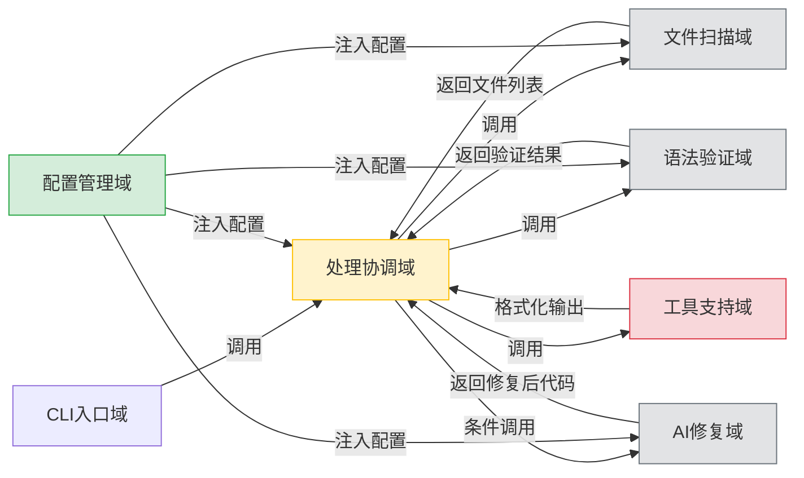
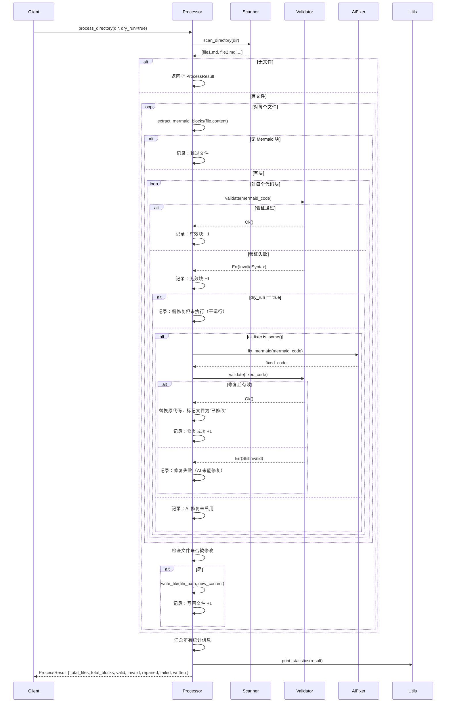

# **技术文档：处理协调域（Processor Domain）**

---

## **1. 概述**

**处理协调域**（Processor Domain）是 `mermaid-fixer` 系统的核心流程控制中枢，负责**编排、调度与协调**整个 Mermaid 图表自动化修复流程。它不直接实现语法解析、文件扫描或 AI 修复等具体业务逻辑，而是作为“指挥官”（Orchestrator），通过组合和调用其他独立模块（文件扫描、语法验证、AI 修复），实现端到端的文档质量修复闭环。

该模块的设计严格遵循 **“单一职责原则”** 与 **“控制与实现分离”** 的架构理念，确保系统具备高内聚、低耦合、易测试、可扩展的特性。其核心价值在于：**将复杂的多步骤自动化流程抽象为可配置、可观察、可复用的协调逻辑**，使系统在保持轻量级的同时，具备工业级的稳定性与可维护性。

---

## **2. 核心职责**

处理协调域承担以下关键职责：

| 职责 | 描述 |
|------|------|
| **流程编排** | 按照预定义工作流（扫描 → 验证 → 修复 → 写回）有序调用各子模块，确保流程逻辑正确、无遗漏。 |
| **执行策略控制** | 根据配置（如 `dry_run`、`enable_ai_repair`）动态决定是否执行修复、是否写回文件，实现“干运行”与“实际修复”模式切换。 |
| **状态聚合与统计** | 收集各子模块的处理结果（成功、失败、修复次数、跳过数等），构建统一的 `ProcessResult` 统计对象，为最终输出提供数据基础。 |
| **异常边界处理** | 对子模块调用失败（如网络超时、文件权限错误）进行容错处理，避免流程中断，确保“部分失败不影响整体运行”。 |
| **文件写回决策** | 判断文件是否因修复而被修改，仅在必要时执行写入操作，避免无意义的磁盘 I/O 和版本控制系统变更。 |
| **异步流程管理** | 在异步运行时环境中（Rust `async/await`），协调多个 I/O 密集型操作（文件读写、HTTP 请求），提升吞吐效率。 |

> ✅ **设计哲学**：**“不实现业务，只调度业务”** —— 所有具体逻辑均由独立模块实现，处理协调域仅负责“何时调用、如何组合、结果如何汇总”。

---

## **3. 架构与模块交互**

### **3.1 模块依赖关系图（逻辑视图）**



### **3.2 依赖注入模式**

处理协调域采用 **依赖注入（Dependency Injection）** 模式，所有子模块通过构造函数传入，实现：

- **解耦**：无需硬编码模块实现，便于替换（如用 Mock 替代真实 AI 修复器）。
- **可测试性**：可注入模拟对象（Mock）进行单元测试，无需真实网络或文件系统。
- **配置驱动**：子模块的配置（如 LLM API 密钥、超时）由配置管理域统一注入，确保一致性。

```rust
// src/processor.rs - 核心结构体定义
pub struct MermaidProcessor<'a> {
    scanner: &'a dyn MarkdownScanner,
    validator: &'a dyn MermaidValidator,
    ai_fixer: Option<&'a dyn AiFixer>, // 可选，由配置决定是否启用
    config: &'a Config,
}

impl<'a> MermaidProcessor<'a> {
    pub fn new(
        scanner: &'a dyn MarkdownScanner,
        validator: &'a dyn MermaidValidator,
        ai_fixer: Option<&'a dyn AiFixer>,
        config: &'a Config,
    ) -> Self {
        Self {
            scanner,
            validator,
            ai_fixer,
            config,
        }
    }
}
```

> 🔍 **关键设计点**：`ai_fixer` 为 `Option<&dyn AiFixer>`，在 `dry_run` 或 `enable_ai_repair=false` 时为 `None`，避免无效调用。

---

## **4. 核心算法流程（详细逻辑）**

### **4.1 主流程：`process_directory()`**



### **4.2 关键决策逻辑**

| 判断点 | 条件 | 行为 |
|--------|------|------|
| **是否启用 AI 修复** | `config.enable_ai_repair == true` 且 `ai_fixer.is_some()` | 才进入修复流程 |
| **是否写回文件** | `dry_run == false` 且 **至少一个代码块被修复** | 执行文件写入 |
| **修复后是否有效** | 修复后再次调用 `validate(fixed_code)` | 必须二次验证，确保 AI 输出符合语法规范 |
| **文件是否修改** | 仅当至少一个代码块被替换时为 `true` | 避免无变更的写入，减少 Git 提交噪声 |

> ✅ **重要原则**：**“修复 ≠ 写入”**。AI 可能失败，即使调用了修复器，也必须二次验证，确保输出合法。写入操作仅在**确认修改有效**后才执行。

---

## **5. 数据结构设计**

### **5.1 核心结果结构体**

```rust
// src/processor.rs

#[derive(Debug, Clone, Default)]
pub struct ProcessResult {
    pub total_files: usize,           // 总扫描文件数
    pub total_blocks: usize,          // 总 Mermaid 代码块数
    pub valid_blocks: usize,          // 语法有效的块数
    pub invalid_blocks: usize,        // 语法无效的块数
    pub repaired_blocks: usize,       // 成功修复的块数
    pub failed_repair_blocks: usize,  // AI 修复失败的块数
    pub written_files: usize,         // 实际写回的文件数
    pub skipped_files: usize,         // 无 Mermaid 块的文件数
}

#[derive(Debug, Clone)]
pub struct FileProcessResult {
    pub file_path: PathBuf,
    pub blocks_processed: usize,
    pub blocks_valid: usize,
    pub blocks_invalid: usize,
    pub blocks_repaired: usize,
    pub blocks_failed_repair: usize,
    pub modified: bool, // 是否被修改（决定是否写回）
}
```

### **5.2 状态追踪机制**

- 每个文件处理后生成 `FileProcessResult`，记录细粒度统计。
- 所有 `FileProcessResult` 被聚合为 `ProcessResult`，作为最终输出。
- 所有状态均为 **不可变结构体**，避免并发修改风险，符合 Rust 安全范式。

---

## **6. 异步与性能优化**

### **6.1 异步模型设计**

处理协调域采用 **异步非阻塞模型**（`async/await`），主要优化点：

| 操作 | 异步化原因 |
|------|------------|
| 文件读写 | 避免阻塞主线程，提升 I/O 并发能力 |
| LLM API 调用 | 网络延迟高，异步可并行处理多个请求 |
| 日志输出 | 避免同步写入影响主流程 |

```rust
impl<'a> MermaidProcessor<'a> {
    pub async fn process_directory(&self, dir: &Path) -> Result<ProcessResult, ProcessorError> {
        let files = self.scanner.scan_directory(dir).await?;
        let mut results = Vec::new();

        for file in files {
            let result = self.process_single_file(&file).await?;
            results.push(result);
        }

        Ok(ProcessResult::aggregate(results))
    }

    async fn process_single_file(&self, file_path: &Path) -> Result<FileProcessResult, ProcessorError> {
        let content = fs::read_to_string(file_path).await?;
        let blocks = extract_mermaid_blocks(&content); // 工具函数

        let mut modified = false;
        let mut repaired_count = 0;
        let mut failed_count = 0;

        let mut new_content = content.clone();
        for (idx, block) in blocks.iter().enumerate() {
            match self.validator.validate(&block.code).await {
                Ok(_) => { /* 记录有效 */ }
                Err(_) => {
                    if !self.config.dry_run && self.ai_fixer.is_some() {
                        match self.ai_fixer.unwrap().fix_mermaid(&block.code).await {
                            Ok(fixed) => {
                                if self.validator.validate(&fixed).await.is_ok() {
                                    new_content = new_content.replace(&block.code, &fixed);
                                    repaired_count += 1;
                                    modified = true;
                                } else {
                                    failed_count += 1;
                                }
                            }
                            Err(_) => failed_count += 1,
                        }
                    }
                }
            }
        }

        if modified && !self.config.dry_run {
            fs::write(file_path, new_content).await?;
        }

        Ok(FileProcessResult {
            file_path: file_path.to_path_buf(),
            blocks_processed: blocks.len(),
            blocks_valid: ...,
            blocks_invalid: ...,
            blocks_repaired: repaired_count,
            blocks_failed_repair: failed_count,
            modified,
        })
    }
}
```

> ✅ **优势**：在处理 100+ 文件时，异步并发可将总耗时从分钟级降至秒级，尤其在 LLM API 响应延迟高的场景下表现显著。

---

## **7. 错误处理与容错机制**

处理协调域采用 **“失败不中断”** 的容错策略：

| 错误类型 | 处理方式 |
|----------|----------|
| 文件读取失败（权限/不存在） | 记录错误日志，跳过该文件，继续处理其他文件 |
| 语法验证失败 | 记录为“无效块”，继续处理后续块 |
| AI 修复失败（网络超时、API 错误） | 记录为“修复失败”，不中断流程，不写回 |
| 修复后验证失败 | 记录为“修复失败”，不写回，保留原内容 |
| 写回文件失败（磁盘满、权限） | 记录错误，但不终止流程，继续处理剩余文件 |

> 🛡️ **设计原则**：**“系统应容忍局部失败，而非因单点故障而崩溃”**。所有错误均被记录在 `ProcessResult` 的 `errors` 字段中，供日志或 CI 报告分析。

---

## **8. 可测试性设计**

处理协调域是**单元测试友好型**模块，支持以下测试模式：

| 测试类型 | 实现方式 |
|----------|----------|
| **单元测试** | 注入 Mock Scanner/Validator/AiFixer，验证流程逻辑是否按预期调用 |
| **集成测试** | 使用真实文件系统 + 模拟 LLM 响应（如 `mockito`），验证端到端行为 |
| **配置驱动测试** | 通过不同 `Config` 实例（`dry_run=true/false`, `enable_ai_repair=false`）验证行为差异 |

```rust
#[cfg(test)]
mod tests {
    use super::*;
    use mockall::mock;

    mock! {
        pub Scanner {}
        impl MarkdownScanner for Scanner {
            async fn scan_directory(&self, dir: &Path) -> Result<Vec<PathBuf>, Error>;
        }
    }

    #[tokio::test]
    async fn test_process_directory_dry_run() {
        let mut scanner = MockScanner::new();
        scanner.expect_scan_directory().returning(|_| Ok(vec![PathBuf::from("test.md")]));

        let mut validator = MockValidator::new();
        validator.expect_validate().returning(|_| Err(ValidationError::Syntax));

        let processor = MermaidProcessor::new(&scanner, &validator, None, &config_dry_run);

        let result = processor.process_directory(&Path::new("/tmp")).await.unwrap();
        assert_eq!(result.repaired_blocks, 0); // 干运行，不修复
        assert_eq!(result.written_files, 0);   // 不写回
    }
}
```

> ✅ **测试覆盖率目标**：处理协调域的逻辑分支（如 `dry_run`、`ai_fixer` 是否启用）应达到 **100% 覆盖**。

---

## **9. 扩展性与未来演进**

处理协调域的设计天然支持以下扩展：

| 扩展方向 | 实现方式 |
|----------|----------|
| **支持多语言图表** | 新增 `CodeBlockValidator` trait，扩展支持 PlantUML、Graphviz，由配置动态注册 |
| **支持多 AI 模型** | 实现 `AiFixer` trait 的多个实现（OpenAI、Claude、本地 Ollama），通过配置切换 |
| **支持修复后格式化** | 在写回前插入 `CodeFormatter` 模块，自动缩进、对齐 Mermaid 代码 |
| **支持并行处理** | 将 `process_single_file` 改为 `join_all` 并行执行，提升吞吐量 |
| **支持修复建议输出** | 新增 `--output-suggestions` 模式，将修复建议写入 `.fixes.json`，不修改原文件 |

> 🔮 **架构优势**：由于所有子模块通过接口（trait）交互，新增功能无需修改 `processor.rs`，只需实现新模块并注入即可。

---

## **10. 总结：为什么处理协调域是系统的关键**

| 维度 | 价值体现 |
|------|----------|
| **架构清晰性** | 明确划分“控制”与“实现”，避免逻辑混杂，提升可维护性 |
| **稳定性保障** | 容错设计确保“部分失败不影响整体”，适合 CI/CD 环境 |
| **可配置性** | 所有行为由配置驱动，支持“一键切换”修复模式 |
| **可测试性** | 模块解耦 + 依赖注入，实现高覆盖率自动化测试 |
| **性能优化** | 异步模型显著提升大规模文档处理效率 |
| **扩展潜力** | 开闭原则支持未来新增图表类型、修复引擎、输出格式 |

> ✅ **最终结论**：  
> **处理协调域不是最复杂的模块，但它是系统最核心的“神经系统”**。它决定了自动化流程是否可靠、高效、可控。其设计质量直接决定了 `mermaid-fixer` 是否能从“一个工具”成长为“企业级文档质量保障基础设施”。

---

## **附录：关键代码文件**

| 文件路径 | 说明 |
|----------|------|
| `src/processor.rs` | 核心实现，包含 `MermaidProcessor` 结构体与 `process_directory` 方法 |
| `src/processor/mod.rs` | 模块导出与公共接口定义 |
| `src/processor/error.rs` | 自定义错误类型（`ProcessorError`） |
| `src/processor/result.rs` | `ProcessResult` 与 `FileProcessResult` 定义 |
| `tests/processor.rs` | 单元与集成测试用例 |

---

> 📌 **推荐实践**：  
> 在 CI/CD 流程中，建议将 `mermaid-fixer` 的 `--dry-run` 模式作为“文档质量门禁”（Quality Gate），若检测到无效块则失败构建，强制修复后再合并。处理协调域正是实现这一策略的**技术基石**。